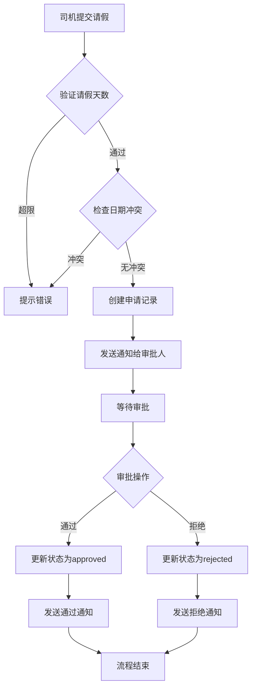

# 核心业务功能技术文档

## 一、概述

本文档详细说明车队管家系统的核心业务功能实现,包括考勤管理、计件工资、请假离职、车辆管理、通知系统等模块的技术架构和实现细节。

### 1.1 核心业务模块

```
核心业务系统
├── 考勤管理 (Attendance Management)
│   ├── 上下班打卡
│   ├── 考勤记录查询
│   ├── 考勤统计分析
│   └── 考勤规则配置
│
├── 计件工资 (Piece Work)
│   ├── 计件记录录入
│   ├── 品类价格配置
│   ├── 工资统计计算
│   └── 收入报表生成
│
├── 请假离职 (Leave & Resignation)
│   ├── 请假申请提交
│   ├── 离职申请管理
│   ├── 审批流程处理
│   └── 状态通知推送
│
├── 车辆管理 (Vehicle Management)
│   ├── 车辆信息维护
│   ├── 车辆审核流程
│   ├── 车辆记录管理
│   └── OCR信息识别
│
└── 通知系统 (Notification System)
    ├── 系统通知推送
    ├── 审批通知
    ├── 状态变更通知
    └── 通知模板管理
```

### 1.2 技术栈

- **前端**: React + Taro + TypeScript
- **后端**: Supabase PostgreSQL
- **状态管理**: React Context + Hooks
- **数据验证**: 应用层权限控制

---

## 二、考勤管理系统

### 2.1 系统架构

#### 数据模型

```typescript
// 考勤记录接口
interface AttendanceRecord {
  id: string                    // 记录ID
  user_id: string               // 用户ID
  date: string                  // 日期
  clock_in_time: string | null  // 上班打卡时间
  clock_out_time: string | null // 下班打卡时间
  warehouse_id: string | null   // 仓库ID
  status: AttendanceStatus      // 考勤状态
  notes: string | null          // 备注
  work_hours: number | null     // 工作小时数
  created_at: string           // 创建时间
}

// 考勤状态
type AttendanceStatus = 'normal' | 'late' | 'early' | 'absent'
```

#### 数据库表结构

```sql
CREATE TABLE attendance (
  id UUID PRIMARY KEY DEFAULT gen_random_uuid(),
  user_id UUID NOT NULL REFERENCES users(id) ON DELETE CASCADE,
  date DATE NOT NULL,
  clock_in_time TIMESTAMPTZ,
  clock_out_time TIMESTAMPTZ,
  warehouse_id UUID REFERENCES warehouses(id) ON DELETE SET NULL,
  status TEXT DEFAULT 'normal',
  notes TEXT,
  work_hours DECIMAL(5,2),
  created_at TIMESTAMPTZ DEFAULT NOW(),
  UNIQUE(user_id, date)  -- 每天只能有一条考勤记录
);
```

### 2.2 核心功能实现

#### 1. 上班打卡

**API位置**: `src/db/api/attendance.ts`

```typescript
/**
 * 创建上班打卡记录
 * @param userId 用户ID
 * @param warehouseId 仓库ID
 * @param notes 备注
 * @returns 考勤记录ID
 */
async function createClockIn(
  userId: string,
  warehouseId?: string,
  notes?: string
): Promise<string> {
  // 1. 检查今天是否已打卡
  const today = new Date().toISOString().split('T')[0]
  const existing = await getTodayAttendance(userId)
  
  if (existing && existing.clock_in_time) {
    throw new Error('今天已经打过卡了')
  }
  
  // 2. 创建打卡记录
  const { data, error } = await supabase
    .from('attendance')
    .insert({
      user_id: userId,
      date: today,
      clock_in_time: new Date().toISOString(),
      warehouse_id: warehouseId,
      notes,
      status: 'normal'
    })
    .select('id')
    .single()
  
  if (error) throw error
  return data.id
}
```

#### 2. 下班打卡

```typescript
/**
 * 下班打卡（更新打卡记录）
 * @param attendanceId 考勤记录ID
 * @returns 是否成功
 */
async function updateClockOut(attendanceId: string): Promise<boolean> {
  const clockOutTime = new Date().toISOString()
  
  // 1. 获取上班打卡时间
  const { data: record } = await supabase
    .from('attendance')
    .select('clock_in_time')
    .eq('id', attendanceId)
    .single()
  
  if (!record?.clock_in_time) {
    throw new Error('未找到上班打卡记录')
  }
  
  // 2. 计算工作时长
  const clockIn = new Date(record.clock_in_time)
  const clockOut = new Date(clockOutTime)
  const workHours = (clockOut.getTime() - clockIn.getTime()) / (1000 * 60 * 60)
  
  // 3. 更新记录
  const { error } = await supabase
    .from('attendance')
    .update({
      clock_out_time: clockOutTime,
      work_hours: workHours.toFixed(2)
    })
    .eq('id', attendanceId)
  
  return !error
}
```

#### 3. 考勤检查逻辑

**文件位置**: `src/utils/attendance-check.ts`

```typescript
/**
 * 检查今日考勤状态
 * 用于计件录入前的考勤验证
 */
export async function checkTodayAttendance(
  userId: string
): Promise<AttendanceCheckResult> {
  const today = new Date().toISOString().split('T')[0]
  
  // 1. 查询今日考勤记录
  const attendance = await getTodayAttendance(userId)
  
  // 2. 查询今日请假记录
  const leaveApp = await supabase
    .from('leave_applications')
    .select('*')
    .eq('driver_id', userId)
    .eq('status', 'approved')
    .lte('start_date', today)
    .gte('end_date', today)
    .maybeSingle()
  
  // 3. 判断状态
  if (leaveApp.data) {
    return {
      needClockIn: false,
      hasClockedIn: false,
      onLeave: true,
      message: '今天在休假中'
    }
  }
  
  if (attendance && attendance.clock_in_time) {
    return {
      needClockIn: false,
      hasClockedIn: true,
      onLeave: false,
      message: '已打卡'
    }
  }
  
  return {
    needClockIn: true,
    hasClockedIn: false,
    onLeave: false,
    message: '今天尚未打卡'
  }
}
```

### 2.3 权限控制

#### 角色权限矩阵

| 操作 | BOSS | PEER_ADMIN | MANAGER | DRIVER |
|------|------|------------|---------|--------|
| 查看所有考勤 | ✅ | ✅ | ❌ | ❌ |
| 查看管辖考勤 | ✅ | ✅ | ✅ | ❌ |
| 查看自己考勤 | ✅ | ✅ | ✅ | ✅ |
| 创建考勤记录 | ✅ | ✅ | ✅ | ✅ |
| 修改考勤记录 | ✅ | ✅ | ✅ | ❌ |

### 2.4 业务规则

1. **唯一性约束**: 每个用户每天只能有一条考勤记录
2. **打卡顺序**: 必须先上班打卡才能下班打卡
3. **计件关联**: 未打卡不能进行计件录入
4. **请假优先**: 请假期间自动免打卡

---

## 三、计件工资系统

### 3.1 系统架构

#### 数据模型

```typescript
// 计件记录
interface PieceWorkRecord {
  id: string
  user_id: string           // 用户ID
  warehouse_id: string      // 仓库ID
  category_id: string       // 品类ID
  work_date: string         // 工作日期
  quantity: number          // 数量
  unit_price: number        // 单价
  total_amount: number      // 总金额
  notes: string | null      // 备注
  created_at: string
}

// 品类价格配置
interface CategoryPrice {
  id: string
  warehouse_id: string      // 仓库ID
  category_id: string       // 品类ID
  driver_type: 'pure' | 'with_vehicle'  // 司机类型
  base_price: number        // 基础价格
  floor_fee: number         // 上楼费
  sort_fee: number          // 分拣费
}
```

#### 数据库表结构

```sql
-- 计件记录表
CREATE TABLE piece_work_records (
  id UUID PRIMARY KEY DEFAULT gen_random_uuid(),
  user_id UUID NOT NULL REFERENCES users(id),
  warehouse_id UUID REFERENCES warehouses(id),
  category_id UUID REFERENCES categories(id),
  work_date DATE NOT NULL,
  quantity INTEGER NOT NULL DEFAULT 0,
  unit_price DECIMAL(10, 2),
  total_amount DECIMAL(10, 2),
  notes TEXT,
  created_at TIMESTAMPTZ DEFAULT NOW()
);

-- 品类价格表
CREATE TABLE category_prices (
  id UUID PRIMARY KEY DEFAULT gen_random_uuid(),
  warehouse_id UUID REFERENCES warehouses(id),
  category_id UUID REFERENCES categories(id),
  driver_type TEXT CHECK(driver_type IN ('pure', 'with_vehicle')),
  base_price DECIMAL(10, 2) NOT NULL,
  floor_fee DECIMAL(10, 2) DEFAULT 0,
  sort_fee DECIMAL(10, 2) DEFAULT 0,
  is_active BOOLEAN DEFAULT true,
  created_at TIMESTAMPTZ DEFAULT NOW(),
  UNIQUE(warehouse_id, category_id, driver_type)
);
```

### 3.2 核心功能实现

#### 1. 计件记录录入

**API位置**: `src/db/api/piecework.ts`

```typescript
/**
 * 创建计件记录
 */
async function createPieceWorkRecord(data: {
  user_id: string
  warehouse_id: string
  category_id: string
  work_date: string
  quantity: number
  unit_price: number
  total_amount: number
  notes?: string
}): Promise<PieceWorkRecord> {
  // 1. 验证考勤状态
  const canWork = await canStartPieceWork(data.user_id)
  if (!canWork.canStart) {
    throw new Error(canWork.reason || '无法进行计件录入')
  }
  
  // 2. 创建记录
  const { data: record, error } = await supabase
    .from('piece_work_records')
    .insert(data)
    .select()
    .single()
  
  if (error) throw error
  return record
}
```

#### 2. 计件统计计算

```typescript
/**
 * 计算用户计件统计
 * @param userId 用户ID
 * @param year 年份
 * @param month 月份（1-12）
 */
async function calculatePieceWorkStats(
  userId: string,
  year: number,
  month: number
): Promise<PieceWorkStats> {
  const { data, error } = await supabase
    .from('piece_work_records')
    .select('quantity, total_amount, work_date')
    .eq('user_id', userId)
    .gte('work_date', `${year}-${month.toString().padStart(2, '0')}-01`)
    .lt('work_date', getNextMonthStart(year, month))
  
  if (error) throw error
  
  // 计算统计数据
  const totalQuantity = data.reduce((sum, r) => sum + r.quantity, 0)
  const totalAmount = data.reduce((sum, r) => sum + Number(r.total_amount), 0)
  const workDays = new Set(data.map(r => r.work_date)).size
  
  return {
    totalQuantity,
    totalAmount,
    workDays,
    averagePerDay: workDays > 0 ? totalQuantity / workDays : 0,
    records: data
  }
}
```

#### 3. 品类价格获取

```typescript
/**
 * 获取司机的品类价格
 * 根据司机类型（纯司机/带车司机）返回对应价格
 */
async function getCategoryPriceForDriver(
  warehouseId: string,
  categoryId: string,
  driverType: 'pure' | 'with_vehicle'
): Promise<CategoryPrice | null> {
  const { data } = await supabase
    .from('category_prices')
    .select('*')
    .eq('warehouse_id', warehouseId)
    .eq('category_id', categoryId)
    .eq('driver_type', driverType)
    .eq('is_active', true)
    .maybeSingle()
  
  return data
}
```

### 3.3 业务规则

1. **考勤前置**: 必须先完成当日打卡才能录入计件
2. **价格配置**: 根据仓库、品类、司机类型确定单价
3. **费用计算**: 总金额 = (基础价格 + 上楼费 + 分拣费) × 数量
4. **数据隔离**: 司机只能查看自己的计件记录

---

## 四、请假离职管理

### 4.1 系统架构

#### 数据模型

```typescript
// 请假申请
interface LeaveApplication {
  id: string
  driver_id: string         // 申请人ID
  warehouse_id: string      // 仓库ID
  leave_type: LeaveType     // 请假类型
  start_date: string        // 开始日期
  end_date: string          // 结束日期
  days: number             // 天数
  reason: string           // 原因
  status: LeaveStatus      // 状态
  reviewer_id: string | null    // 审批人ID
  reviewed_at: string | null    // 审批时间
  review_notes: string | null   // 审批备注
}

type LeaveType = 'sick' | 'personal' | 'annual' | 'other'
type LeaveStatus = 'pending' | 'approved' | 'rejected'

// 离职申请
interface ResignationApplication {
  id: string
  driver_id: string
  resignation_date: string  // 离职日期
  reason: string
  status: 'pending' | 'approved' | 'rejected'
  reviewer_id: string | null
  reviewed_at: string | null
}
```

### 4.2 核心功能实现

#### 1. 提交请假申请

**API位置**: `src/db/api/leave.ts`

```typescript
/**
 * 创建请假申请
 */
async function createLeaveApplication(data: {
  driver_id: string
  warehouse_id: string
  leave_type: LeaveType
  start_date: string
  end_date: string
  days: number
  reason: string
}): Promise<LeaveApplication> {
  // 1. 验证请假天数
  const maxDays = await getWarehouseMaxLeaveDays(data.warehouse_id)
  if (data.days > maxDays) {
    throw new Error(`请假天数不能超过${maxDays}天`)
  }
  
  // 2. 检查日期冲突
  const hasConflict = await checkLeaveDateConflict(
    data.driver_id,
    data.start_date,
    data.end_date
  )
  if (hasConflict) {
    throw new Error('请假日期与已有请假冲突')
  }
  
  // 3. 创建申请
  const { data: application, error } = await supabase
    .from('leave_applications')
    .insert({
      ...data,
      status: 'pending'
    })
    .select()
    .single()
  
  if (error) throw error
  
  // 4. 发送通知给审批人
  await sendLeaveNotification(application)
  
  return application
}
```

#### 2. 审批请假申请

```typescript
/**
 * 审批请假申请
 */
async function reviewLeaveApplication(
  applicationId: string,
  reviewerId: string,
  approved: boolean,
  notes?: string
): Promise<boolean> {
  const status = approved ? 'approved' : 'rejected'
  
  // 1. 更新审批状态
  const { error } = await supabase
    .from('leave_applications')
    .update({
      status,
      reviewer_id: reviewerId,
      reviewed_at: new Date().toISOString(),
      review_notes: notes
    })
    .eq('id', applicationId)
  
  if (error) throw error
  
  // 2. 发送审批结果通知
  await sendReviewNotification(applicationId, approved)
  
  return true
}
```

### 4.3 审批流程



### 4.4 业务规则

1. **天数限制**: 请假天数不能超过仓库配置的最大天数
2. **日期检查**: 不能与已有请假日期冲突
3. **审批权限**: 只有BOSS、PEER_ADMIN和对应仓库的MANAGER可以审批
4. **状态通知**: 审批后自动通知申请人

---

## 五、车辆管理系统

### 5.1 系统架构

#### 数据模型

```typescript
// 车辆信息
interface Vehicle {
  id: string
  driver_id: string          // 司机ID
  plate_number: string       // 车牌号
  brand: string              // 品牌
  model: string              // 型号
  color: string              // 颜色
  vehicle_type: string       // 车辆类型
  status: VehicleStatus      // 状态
  photos: string[]           // 照片URLs
  registration_photo: string // 行驶证照片
  created_at: string
}

type VehicleStatus = 'pending' | 'approved' | 'rejected'

// 车辆记录
interface VehicleRecord {
  id: string
  vehicle_id: string
  record_type: 'maintenance' | 'accident' | 'inspection'
  record_date: string
  description: string
  cost: number
}
```

### 5.2 核心功能实现

#### 1. 车辆信息提交

**API位置**: `src/db/api/vehicles.ts`

```typescript
/**
 * 创建车辆信息
 */
async function createVehicle(data: {
  driver_id: string
  plate_number: string
  brand: string
  model: string
  color: string
  vehicle_type: string
  photos: string[]
  registration_photo: string
}): Promise<Vehicle> {
  // 1. 验证车牌号唯一性
  const existing = await supabase
    .from('vehicles')
    .select('id')
    .eq('plate_number', data.plate_number)
    .maybeSingle()
  
  if (existing.data) {
    throw new Error('该车牌号已存在')
  }
  
  // 2. 创建车辆记录
  const { data: vehicle, error } = await supabase
    .from('vehicles')
    .insert({
      ...data,
      status: 'pending'  // 待审核
    })
    .select()
    .single()
  
  if (error) throw error
  
  // 3. 发送审核通知
  await sendVehicleAuditNotification(vehicle)
  
  return vehicle
}
```

#### 2. 车辆审核

```typescript
/**
 * 审核车辆
 */
async function reviewVehicle(
  vehicleId: string,
  reviewerId: string,
  approved: boolean,
  notes?: string
): Promise<boolean> {
  const status = approved ? 'approved' : 'rejected'
  
  const { error } = await supabase
    .from('vehicles')
    .update({
      status,
      reviewer_id: reviewerId,
      reviewed_at: new Date().toISOString(),
      review_notes: notes
    })
    .eq('id', vehicleId)
  
  if (error) throw error
  
  // 发送审核结果通知
  await sendVehicleReviewNotification(vehicleId, approved)
  
  return true
}
```

#### 3. OCR信息识别

**文件位置**: `src/utils/ocr-helper.ts`

```typescript
/**
 * 识别行驶证信息
 */
async function recognizeRegistration(
  imageUrl: string
): Promise<RegistrationInfo> {
  // 调用OCR服务识别行驶证
  const result = await callOCRService(imageUrl, 'vehicle_registration')
  
  return {
    plateNumber: result.plate_number,
    brand: result.brand,
    model: result.model,
    color: result.color,
    vehicleType: result.vehicle_type
  }
}
```

### 5.3 业务规则

1. **车牌唯一**: 系统中车牌号必须唯一
2. **审核流程**: 新车辆提交后需要审核才能使用
3. **照片要求**: 必须上传车辆照片和行驶证照片
4. **OCR辅助**: 支持OCR自动识别车辆信息

---

## 六、通知系统

### 6.1 系统架构

#### 数据模型

```typescript
// 通知记录
interface Notification {
  id: string
  recipient_id: string       // 接收人ID
  sender_id: string | null   // 发送人ID
  title: string              // 标题
  content: string            // 内容
  type: NotificationType     // 类型
  related_id: string | null  // 关联ID
  read: boolean              // 是否已读
  created_at: string
}

type NotificationType = 
  | 'leave_approval'         // 请假审批
  | 'resignation_approval'   // 离职审批
  | 'vehicle_approval'       // 车辆审批
  | 'system'                 // 系统通知
  | 'announcement'           // 公告

// 通知模板
interface NotificationTemplate {
  id: string
  title: string
  content: string
  category: 'general' | 'attendance' | 'piece_work' | 'vehicle' | 'leave'
  is_favorite: boolean
}
```

### 6.2 核心功能实现

#### 1. 发送通知

**API位置**: `src/db/api/notifications.ts`

```typescript
/**
 * 创建通知
 */
async function createNotification(data: {
  recipient_id: string
  sender_id?: string
  title: string
  content: string
  type: NotificationType
  related_id?: string
}): Promise<Notification> {
  const { data: notification, error } = await supabase
    .from('notifications')
    .insert({
      ...data,
      read: false
    })
    .select()
    .single()
  
  if (error) throw error
  return notification
}
```

#### 2. 审批通知工作流

```typescript
/**
 * 发送司机提交操作的通知
 * 通知对象: BOSS、PEER_ADMIN、有管辖权的MANAGER
 */
async function sendDriverSubmissionNotification(data: {
  driverId: string
  warehouseId: string
  title: string
  content: string
  type: NotificationType
  relatedId: string
}) {
  // 1. 获取通知接收人
  const recipients = await Promise.all([
    // 获取所有BOSS
    getBossUsers(),
    // 获取所有PEER_ADMIN
    getPeerAdminUsers(),
    // 获取管辖该仓库的MANAGER
    getWarehouseManagers(data.warehouseId)
  ])
  
  const allRecipients = [
    ...recipients[0],
    ...recipients[1],
    ...recipients[2]
  ]
  
  // 2. 批量创建通知
  const notifications = allRecipients.map(user => ({
    recipient_id: user.id,
    sender_id: data.driverId,
    title: data.title,
    content: data.content,
    type: data.type,
    related_id: data.relatedId
  }))
  
  await supabase
    .from('notifications')
    .insert(notifications)
}
```

### 6.3 通知权限规则

根据记忆中的通知系统权限控制规则:

1. **司机操作通知** → BOSS + PEER_ADMIN + 管辖MANAGER
2. **车队长操作通知** → 目标DRIVER + PEER_ADMIN + BOSS
3. **调度操作通知** → BOSS + 相关DRIVER/MANAGER
4. **老板操作通知** → 根据目标角色分配

### 6.4 通知模板管理

```typescript
/**
 * 获取通知模板
 */
async function getNotificationTemplates(
  category?: string
): Promise<NotificationTemplate[]> {
  let query = supabase
    .from('notification_templates')
    .select('*')
    .order('is_favorite', { ascending: false })
  
  if (category) {
    query = query.eq('category', category)
  }
  
  const { data } = await query
  return data || []
}
```

---

## 七、数据统计与报表

### 7.1 仪表盘统计

**API位置**: `src/db/api/dashboard.ts`

```typescript
/**
 * 获取仓库仪表盘统计
 */
async function getWarehouseDashboardStats(
  warehouseId: string
): Promise<DashboardStats> {
  const today = new Date().toISOString().split('T')[0]
  
  // 并行查询各项统计
  const [
    driverCount,
    todayAttendance,
    todayPieceWork,
    pendingLeaves
  ] = await Promise.all([
    // 司机总数
    supabase
      .from('warehouse_assignments')
      .select('user_id', { count: 'exact' })
      .eq('warehouse_id', warehouseId),
    
    // 今日考勤
    supabase
      .from('attendance')
      .select('*', { count: 'exact' })
      .eq('warehouse_id', warehouseId)
      .eq('date', today),
    
    // 今日计件
    supabase
      .from('piece_work_records')
      .select('quantity')
      .eq('warehouse_id', warehouseId)
      .eq('work_date', today),
    
    // 待审批请假
    supabase
      .from('leave_applications')
      .select('*', { count: 'exact' })
      .eq('warehouse_id', warehouseId)
      .eq('status', 'pending')
  ])
  
  return {
    driverCount: driverCount.count || 0,
    todayAttendanceCount: todayAttendance.count || 0,
    todayPieceCount: todayPieceWork.data?.reduce((sum, r) => sum + r.quantity, 0) || 0,
    pendingLeaveCount: pendingLeaves.count || 0
  }
}
```

### 7.2 统计报表

```typescript
/**
 * 获取司机绩效统计
 */
async function getDriverStats(
  driverId: string,
  startDate: string,
  endDate: string
): Promise<DriverPerformanceStats> {
  // 考勤统计
  const attendance = await supabase
    .from('attendance')
    .select('*')
    .eq('user_id', driverId)
    .gte('date', startDate)
    .lte('date', endDate)
  
  // 计件统计
  const piecework = await supabase
    .from('piece_work_records')
    .select('quantity, total_amount')
    .eq('user_id', driverId)
    .gte('work_date', startDate)
    .lte('work_date', endDate)
  
  return {
    workDays: attendance.data?.length || 0,
    totalQuantity: piecework.data?.reduce((sum, r) => sum + r.quantity, 0) || 0,
    totalIncome: piecework.data?.reduce((sum, r) => sum + Number(r.total_amount), 0) || 0,
    averagePerDay: piecework.data ? 
      piecework.data.reduce((sum, r) => sum + r.quantity, 0) / (attendance.data?.length || 1) : 0
  }
}
```

---

## 八、性能优化策略

### 8.1 查询优化

1. **并行查询**: 使用 `Promise.all` 并行执行独立查询
2. **索引优化**: 为常用查询字段创建索引
3. **分页加载**: 大数据量使用分页

```typescript
// 示例: 并行查询优化
const [users, warehouses, categories] = await Promise.all([
  getAllUsers(),
  getAllWarehouses(),
  getAllCategories()
])
```

### 8.2 缓存策略

1. **前端缓存**: 使用 React Context 缓存用户信息和权限
2. **本地存储**: Taro.setStorageSync 缓存常用配置
3. **实时更新**: 监听数据变化自动刷新

### 8.3 数据库优化

```sql
-- 考勤表索引
CREATE INDEX idx_attendance_user_date ON attendance(user_id, date);
CREATE INDEX idx_attendance_warehouse ON attendance(warehouse_id);

-- 计件记录索引
CREATE INDEX idx_piecework_user_date ON piece_work_records(user_id, work_date);
CREATE INDEX idx_piecework_warehouse ON piece_work_records(warehouse_id);

-- 请假申请索引
CREATE INDEX idx_leave_status ON leave_applications(status);
CREATE INDEX idx_leave_driver ON leave_applications(driver_id);
```

---

## 九、错误处理与验证

### 9.1 输入验证

```typescript
/**
 * 验证请假申请数据
 */
function validateLeaveApplication(data: LeaveApplicationInput): void {
  if (!data.driver_id) throw new Error('司机ID不能为空')
  if (!data.start_date) throw new Error('开始日期不能为空')
  if (!data.end_date) throw new Error('结束日期不能为空')
  
  const start = new Date(data.start_date)
  const end = new Date(data.end_date)
  
  if (end < start) {
    throw new Error('结束日期不能早于开始日期')
  }
  
  if (data.days <= 0) {
    throw new Error('请假天数必须大于0')
  }
}
```

### 9.2 错误提示

```typescript
try {
  await createLeaveApplication(data)
  Taro.showToast({ title: '提交成功', icon: 'success' })
} catch (error) {
  console.error('提交失败:', error)
  Taro.showToast({
    title: error.message || '提交失败',
    icon: 'none',
    duration: 2500
  })
}
```

---

## 十、测试与质量保证

### 10.1 单元测试

```typescript
describe('考勤管理', () => {
  it('应该成功创建上班打卡', async () => {
    const result = await createClockIn('user-id', 'warehouse-id')
    expect(result).toBeDefined()
  })
  
  it('同一天不能重复打卡', async () => {
    await expect(createClockIn('user-id')).rejects.toThrow('今天已经打过卡了')
  })
})
```

### 10.2 集成测试

```typescript
describe('请假审批流程', () => {
  it('完整的请假审批流程', async () => {
    // 1. 提交请假
    const app = await createLeaveApplication(leaveData)
    expect(app.status).toBe('pending')
    
    // 2. 审批通过
    await reviewLeaveApplication(app.id, 'reviewer-id', true)
    
    // 3. 验证状态
    const updated = await getLeaveApplication(app.id)
    expect(updated.status).toBe('approved')
  })
})
```

---

## 十一、总结

本车队管家系统的核心业务功能具有以下特点:

### 优势

- ✅ **功能完整**: 覆盖考勤、计件、请假、车辆等核心场景
- ✅ **权限严格**: 基于角色的多层权限控制
- ✅ **流程规范**: 审批流程清晰，状态管理完善
- ✅ **性能优化**: 并行查询、索引优化、缓存策略
- ✅ **用户体验**: 友好的错误提示和操作反馈

### 技术亮点

1. **应用层权限控制**: 统一的权限验证机制
2. **业务规则引擎**: 灵活的配置和验证规则
3. **通知工作流**: 自动化的审批通知流程
4. **统计分析**: 多维度的数据统计和报表
5. **模块化设计**: 清晰的API模块划分

---

**文档版本**: 1.0.0  
**创建时间**: 2025-12-11  
**维护人员**: 系统开发团队  
**状态**: 已发布
