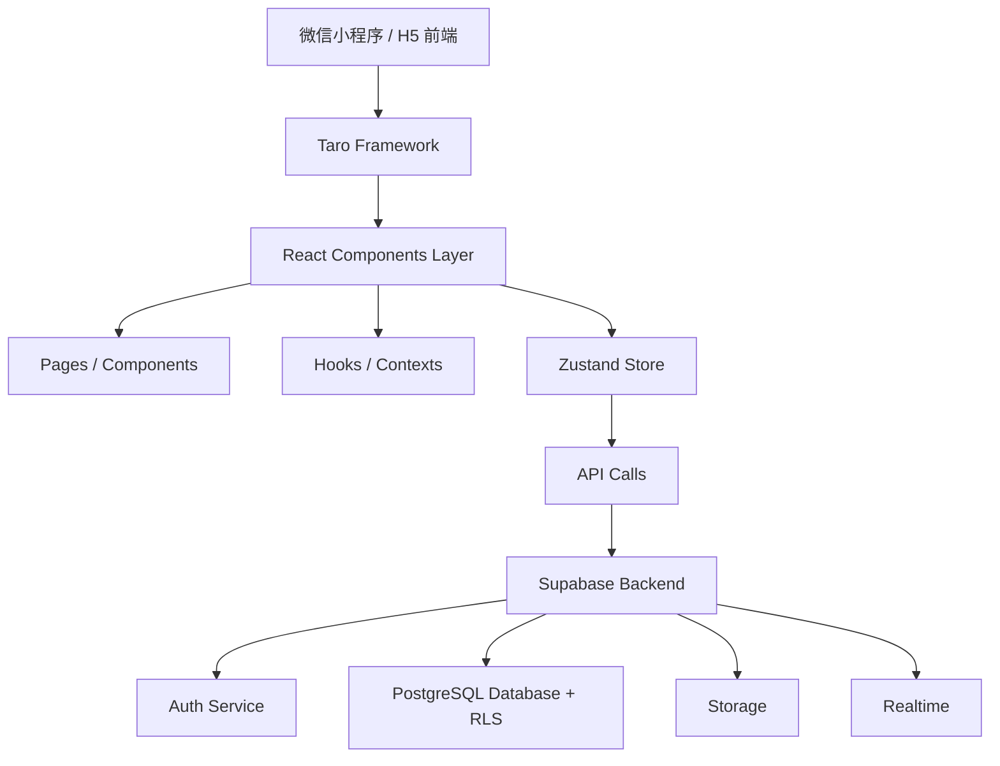
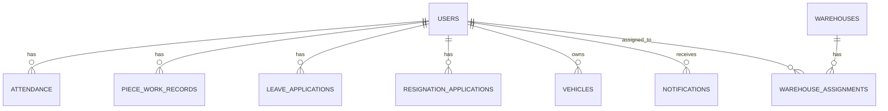
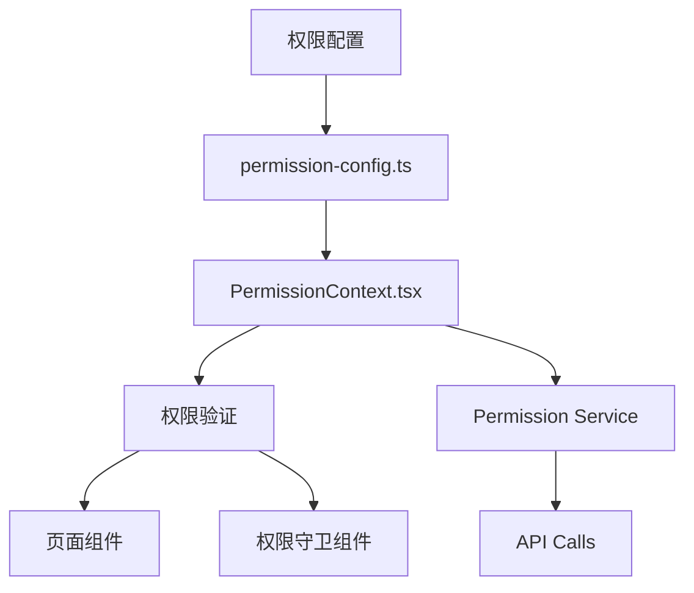
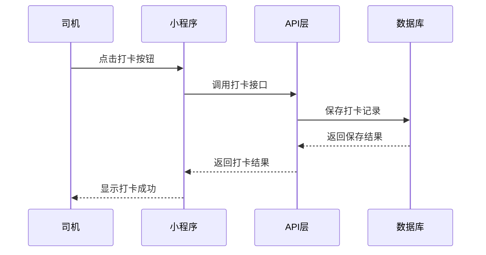
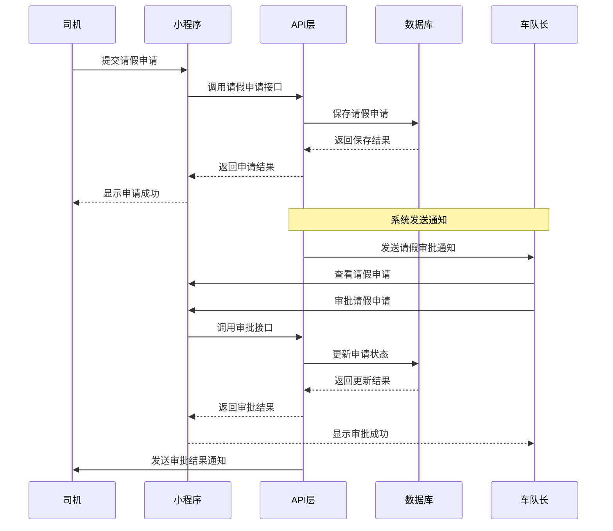
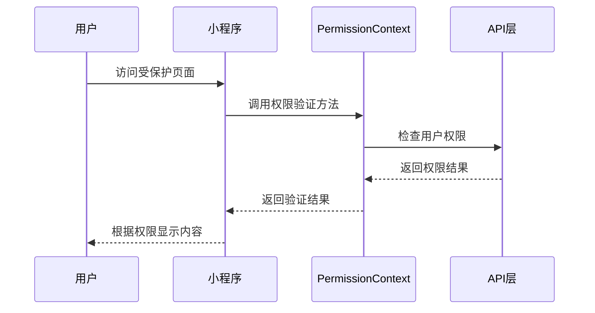

# 车队管家系统功能文档

## 一、系统概述

车队管家是一款专为物流车队打造的微信小程序管理系统，提供完整的车队运营管理解决方案。支持多角色权限管理（老板/调度/车队长/司机），基于Supabase的RLS实现数据安全隔离，具备实时数据同步和完整的统计分析功能。

### 1. 技术栈
- **前端框架**: Taro 3.x (React)
- **UI 框架**: Tailwind CSS
- **状态管理**: Zustand
- **后端服务**: Supabase
  - 认证系统
  - PostgreSQL 数据库
  - Row Level Security (RLS)
  - 实时订阅
- **开发工具**: TypeScript, ESLint, Biome

### 2. 系统架构图

## 二、功能模块

### 1. 用户认证模块

#### 功能说明
提供用户登录、注册、登出等认证功能，支持多种角色的权限管理。

#### 核心功能
- 手机号登录
- 测试账号快捷登录
- 用户信息管理
- 角色权限验证

#### 技术实现
- 使用Supabase Auth服务
- 角色信息存储在users表的role字段
- 权限验证通过PermissionContext实现

### 2. 司机端功能

#### 每日打卡功能
- 上班打卡
- 下班打卡
- 打卡记录查询

#### 计件工作功能
- 计件工作录入
- 计件记录查询
- 计件统计

#### 请假申请功能
- 请假类型选择（病假、事假等）
- 请假时间设置
- 请假理由填写
- 请假状态查询

#### 离职申请功能
- 离职原因填写
- 离职时间设置
- 离职状态查询

#### 车辆信息管理
- 车辆基本信息查看
- 车辆状态查询

#### 通知中心
- 通知消息查看
- 通知状态更新

#### 个人信息管理
- 个人资料编辑
- 密码修改

### 3. 车队长端功能

#### 司机管理
- 司机信息查看
- 司机分配仓库
- 司机状态管理

#### 请假审批
- 请假申请查看
- 请假申请审批（同意/拒绝）
- 审批历史查询

#### 司机考勤统计
- 司机考勤记录查看
- 考勤统计报表
- 异常考勤处理

#### 司机计件统计
- 司机计件记录查看
- 计件统计报表

#### 仓库管理
- 仓库信息查看
- 仓库分配管理

#### 通知管理
- 通知消息发送
- 通知状态查看

### 4. 老板端功能

#### 用户管理
- 用户信息查看
- 用户角色管理
- 用户状态管理

#### 司机类型管理
- 纯司机/带车司机切换

#### 请假/离职审批
- 请假/离职申请查看
- 请假/离职申请审批
- 审批历史查询

#### 全局数据统计
- 司机数量统计
- 车辆数量统计
- 考勤统计
- 计件统计

#### 仓库管理
- 仓库信息增删改查

#### 车辆管理
- 车辆信息增删改查
- 车辆状态管理

#### 权限管理
- 角色权限配置
- 权限验证规则管理

### 5. 调度端功能

#### 司机管理
- 司机信息查看

#### 车辆管理
- 车辆信息查看

#### 计件管理
- 计件记录查看
- 计件记录管理

#### 通知管理
- 通知消息发送
- 通知状态查看

#### 报表管理
- 报表查看

## 三、数据模型

### 1. 核心表结构

#### 用户表 (users)
| 字段名 | 数据类型 | 描述 |
|--------|----------|------|
| id | text | 用户ID |
| role | text | 用户角色（BOSS/PEER_ADMIN/MANAGER/DRIVER） |
| phone | text | 手机号码 |
| name | text | 用户姓名 |
| avatar_url | text | 头像URL |
| created_at | timestamptz | 创建时间 |
| updated_at | timestamptz | 更新时间 |

#### 考勤表 (attendance)
| 字段名 | 数据类型 | 描述 |
|--------|----------|------|
| id | uuid | 记录ID |
| driver_id | text | 司机ID |
| clock_in_time | timestamptz | 上班打卡时间 |
| clock_out_time | timestamptz | 下班打卡时间 |
| status | text | 考勤状态 |
| created_at | timestamptz | 创建时间 |

#### 计件记录表 (piece_work_records)
| 字段名 | 数据类型 | 描述 |
|--------|----------|------|
| id | uuid | 记录ID |
| driver_id | text | 司机ID |
| work_type | text | 工作类型 |
| quantity | int | 数量 |
| date | date | 工作日期 |
| created_at | timestamptz | 创建时间 |

#### 请假申请表 (leave_applications)
| 字段名 | 数据类型 | 描述 |
|--------|----------|------|
| id | uuid | 申请ID |
| driver_id | text | 司机ID |
| leave_type | text | 请假类型 |
| start_date | date | 开始日期 |
| end_date | date | 结束日期 |
| reason | text | 请假理由 |
| status | text | 审批状态 |
| created_at | timestamptz | 创建时间 |

#### 离职申请表 (resignation_applications)
| 字段名 | 数据类型 | 描述 |
|--------|----------|------|
| id | uuid | 申请ID |
| driver_id | text | 司机ID |
| reason | text | 离职原因 |
| resignation_date | date | 离职日期 |
| status | text | 审批状态 |
| created_at | timestamptz | 创建时间 |

#### 车辆表 (vehicles)
| 字段名 | 数据类型 | 描述 |
|--------|----------|------|
| id | uuid | 车辆ID |
| driver_id | text | 司机ID |
| plate_number | text | 车牌号 |
| vehicle_type | text | 车辆类型 |
| status | text | 车辆状态 |
| created_at | timestamptz | 创建时间 |

#### 通知表 (notifications)
| 字段名 | 数据类型 | 描述 |
|--------|----------|------|
| id | uuid | 通知ID |
| recipient_id | text | 接收者ID |
| title | text | 通知标题 |
| content | text | 通知内容 |
| status | text | 通知状态 |
| created_at | timestamptz | 创建时间 |

#### 仓库表 (warehouses)
| 字段名 | 数据类型 | 描述 |
|--------|----------|------|
| id | uuid | 仓库ID |
| name | text | 仓库名称 |
| address | text | 仓库地址 |
| created_at | timestamptz | 创建时间 |

#### 仓库分配表 (warehouse_assignments)
| 字段名 | 数据类型 | 描述 |
|--------|----------|------|
| id | uuid | 分配ID |
| warehouse_id | uuid | 仓库ID |
| driver_id | text | 司机ID |
| created_at | timestamptz | 创建时间 |

## 四、权限管理系统

### 1. 权限系统架构

### 2. 角色权限配置

| 角色 | 权限描述 |
|------|----------|
| BOSS | 所有权限 |
| PEER_ADMIN | 用户管理、请假/离职审批、全局数据统计、仓库管理、车辆管理 |
| MANAGER | 司机管理、请假审批、司机考勤统计、司机计件统计、仓库管理、通知管理 |
| DRIVER | 每日打卡、计件工作录入、请假申请、离职申请、车辆信息管理、通知中心、个人信息管理 |

### 3. 权限代码列表

#### 司机管理模块
- `driver:view` - 查看司机信息
- `driver:manage` - 管理司机（增删改）
- `driver:verify` - 审核司机实名

#### 车辆管理模块
- `vehicle:view` - 查看车辆信息
- `vehicle:manage` - 管理车辆（增删改）

#### 计件管理模块
- `piecework:view` - 查看计件记录
- `piecework:manage` - 管理计件记录
- `piecework:approve` - 审核计件记录

#### 通知模块
- `notification:send` - 发送通知
- `notification:view` - 查看通知

#### 报表模块
- `report:view` - 查看报表
- `report:export` - 导出报表

#### 系统管理模块
- `system:admin` - 系统管理
- `system:role` - 角色管理
- `system:permission` - 权限管理

## 五、核心功能流程

### 1. 司机打卡流程

### 2. 请假申请流程

### 3. 权限验证流程

## 六、系统配置

### 1. 环境配置
- 开发环境：config/dev.ts
- 生产环境：config/prod.ts

### 2. 权限配置
- 权限规则定义：src/config/permission-config.ts

### 3. 数据库配置
- Supabase连接配置：src/client/supabase.ts

## 七、部署说明

### 1. 前端部署
- 构建命令：`pnpm run build:h5`
- 部署平台：微信小程序平台、H5服务器

### 2. 后端部署
- 使用Supabase云服务，无需自行部署

## 八、开发规范

### 1. 代码规范
- 组件命名：PascalCase
- 函数命名：camelCase
- 常量命名：UPPER_SNAKE_CASE
- 文件命名：kebab-case

### 2. 开发流程
- 功能分支：`feature/xxx`
- Bug修复分支：`fix/xxx`
- 代码检查：`pnpm run lint`
- 类型检查：`pnpm run type-check`

## 九、维护说明

### 1. 日志管理
- 使用logger.ts进行日志记录
- 支持不同级别的日志输出

### 2. 错误处理
- 统一的错误处理机制
- 用户友好的错误提示

### 3. 性能优化
- 数据请求优化
- 页面加载速度优化
- 图片资源压缩

## 十、附录

### 1. API接口列表

#### 用户认证接口
- `auth.signInWithPassword` - 密码登录
- `auth.signOut` - 登出
- `auth.updateUser` - 更新用户信息

#### 司机管理接口
- `getDrivers` - 获取司机列表
- `getDriverById` - 获取司机详情
- `createDriver` - 创建司机
- `updateDriver` - 更新司机信息
- `deleteDriver` - 删除司机

#### 车辆管理接口
- `getVehicles` - 获取车辆列表
- `getVehicleById` - 获取车辆详情
- `createVehicle` - 创建车辆
- `updateVehicle` - 更新车辆信息
- `deleteVehicle` - 删除车辆

#### 考勤管理接口
- `clockIn` - 上班打卡
- `clockOut` - 下班打卡
- `getAttendanceRecords` - 获取考勤记录

#### 计件管理接口
- `createPieceWorkRecord` - 创建计件记录
- `getPieceWorkRecords` - 获取计件记录

#### 请假管理接口
- `createLeaveApplication` - 创建请假申请
- `getLeaveApplications` - 获取请假申请
- `approveLeaveApplication` - 审批请假申请

#### 通知管理接口
- `getUserNotifications` - 获取用户通知
- `updateNotificationStatus` - 更新通知状态
- `sendNotification` - 发送通知

### 2. 权限代码索引

| 权限代码 | 权限名称 | 所属模块 |
|----------|----------|----------|
| driver:view | 查看司机信息 | 司机管理 |
| driver:manage | 管理司机 | 司机管理 |
| driver:verify | 审核司机实名 | 司机管理 |
| vehicle:view | 查看车辆信息 | 车辆管理 |
| vehicle:manage | 管理车辆 | 车辆管理 |
| piecework:view | 查看计件记录 | 计件管理 |
| piecework:manage | 管理计件记录 | 计件管理 |
| piecework:approve | 审核计件记录 | 计件管理 |
| notification:send | 发送通知 | 通知管理 |
| notification:view | 查看通知 | 通知管理 |
| report:view | 查看报表 | 报表管理 |
| report:export | 导出报表 | 报表管理 |
| system:admin | 系统管理 | 系统管理 |
| system:role | 角色管理 | 系统管理 |
| system:permission | 权限管理 | 系统管理 |

### 3. 角色权限对照表

| 角色 | 权限代码 |
|------|----------|
| DRIVER | driver:view, vehicle:view, piecework:view, notification:view |
| MANAGER | driver:view, driver:manage, driver:verify, vehicle:view, vehicle:manage, piecework:view, piecework:manage, piecework:approve, notification:send, notification:view, report:view |
| PEER_ADMIN | driver:view, vehicle:view, piecework:view, piecework:manage, notification:send, notification:view, report:view |
| BOSS | 所有权限 |