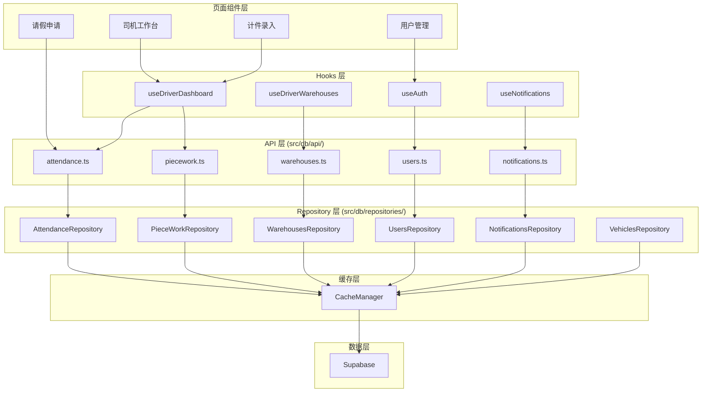

# Database 数据访问层

本目录包含所有数据库相关的操作和工具，基于 Supabase 集成实现。

## 架构概述

本项目采用 **Repository 模式** 作为数据访问层的核心架构，提供统一的 CRUD 操作和缓存管理功能。

### 数据访问架构图



### 核心原则

**所有数据访问必须遵循以下架构**：

```
页面组件 → Hooks → API 层 → Repository 层 → 缓存层 → Supabase
```

**禁止**：
- ❌ 页面组件直接调用 `supabase.from()`
- ❌ Hooks 直接调用 `supabase.from()`
- ❌ API 层直接调用 `supabase.from()`（必须通过 Repository）

## 目录结构

```
src/db/
├── api/                    # API 层函数（调用 Repository）
│   ├── attendance.ts       # 考勤相关 API
│   ├── piecework.ts        # 计件相关 API
│   ├── warehouses.ts       # 仓库相关 API
│   ├── users.ts            # 用户相关 API
│   ├── vehicles.ts         # 车辆相关 API
│   ├── notifications.ts    # 通知相关 API
│   └── leave.ts            # 请假/离职相关 API
├── repositories/           # Repository 层（核心数据访问）
│   ├── BaseRepository.ts   # 基类，提供 CRUD 和缓存
│   ├── UsersRepository.ts
│   ├── AttendanceRepository.ts
│   ├── PieceWorkRepository.ts
│   ├── WarehousesRepository.ts
│   ├── NotificationsRepository.ts
│   ├── VehiclesRepository.ts
│   └── index.ts            # 统一导出
├── realtime/               # Realtime 订阅
│   └── RealtimeCacheInvalidator.ts
├── helpers.ts              # 辅助函数
└── types.ts                # 类型定义
```

## 快速开始

### 1. 导入 Repository

```typescript
import {
  usersRepository,
  attendanceRepository,
  warehousesRepository,
  notificationsRepository
} from '@/db/repositories'
```

### 2. 基本查询

```typescript
// 获取单条记录
const user = await usersRepository.getById('user-123')

// 获取所有记录
const users = await usersRepository.getAll()

// 条件查询
const drivers = await usersRepository.findBy({ role: 'DRIVER' })
```

### 3. 写操作（自动清除缓存）

```typescript
// 创建
const newUser = await usersRepository.create({ name: '张三' })

// 更新
const updated = await usersRepository.update('user-123', { name: '李四' })

// 删除
const success = await usersRepository.delete('user-123')
```

## 可用的 Repository

| Repository | 表名 | TTL | 说明 |
|------------|------|-----|------|
| `usersRepository` | users | 5 分钟 | 用户信息 |
| `attendanceRepository` | attendance | 2 分钟 | 考勤记录 |
| `pieceWorkRepository` | piece_work_records | 2 分钟 | 计件记录 |
| `warehousesRepository` | warehouses | 10 分钟 | 仓库信息 |
| `warehouseAssignmentsRepository` | warehouse_assignments | 5 分钟 | 仓库分配 |
| `notificationsRepository` | notifications | 1 分钟 | 通知消息 |
| `vehiclesRepository` | vehicles | 5 分钟 | 车辆信息 |
| `driverLicensesRepository` | driver_licenses | 5 分钟 | 驾驶证 |
| `categoryPricesRepository` | category_prices | 5 分钟 | 品类价格 |
| `leaveRepository` | leave_applications | 2 分钟 | 请假申请 |
| `resignationApplicationsRepository` | resignation_applications | 2 分钟 | 离职申请 |

## 缓存机制

### 缓存策略

- **读操作**：优先从缓存获取，缓存未命中时从数据库查询
- **写操作**：操作成功后自动清除相关缓存
- **TTL**：每个 Repository 配置不同的缓存有效期

### 缓存失效方式

1. **自动失效**：写操作后自动清除
2. **手动清除**：`repository.clearAllCache()`
3. **事件驱动**：通过 eventBus 触发跨 Repository 缓存失效
4. **Realtime**：监听数据库变更事件自动清除

## 最佳实践

### ✅ 正确用法

```typescript
// 使用 Repository 访问数据
const users = await usersRepository.getAll()

// 使用 API 层函数（内部调用 Repository）
import { getAllUsers } from '@/db/api/users'
const users = await getAllUsers()
```

### ❌ 错误用法

```typescript
// 直接使用 Supabase（绕过缓存）
const { data } = await supabase.from('users').select('*')
```

## 相关文档

- [Repository 模式 API 文档](../../docs/开发指南/Repository模式API文档.md)
- [Repository 使用指南](../../docs/开发指南/Repository使用指南.md)
- [Realtime 缓存失效文档](../../docs/开发指南/Realtime缓存失效文档.md)
- [全局缓存系统使用指南](../../docs/开发指南/全局缓存系统使用指南.md)
