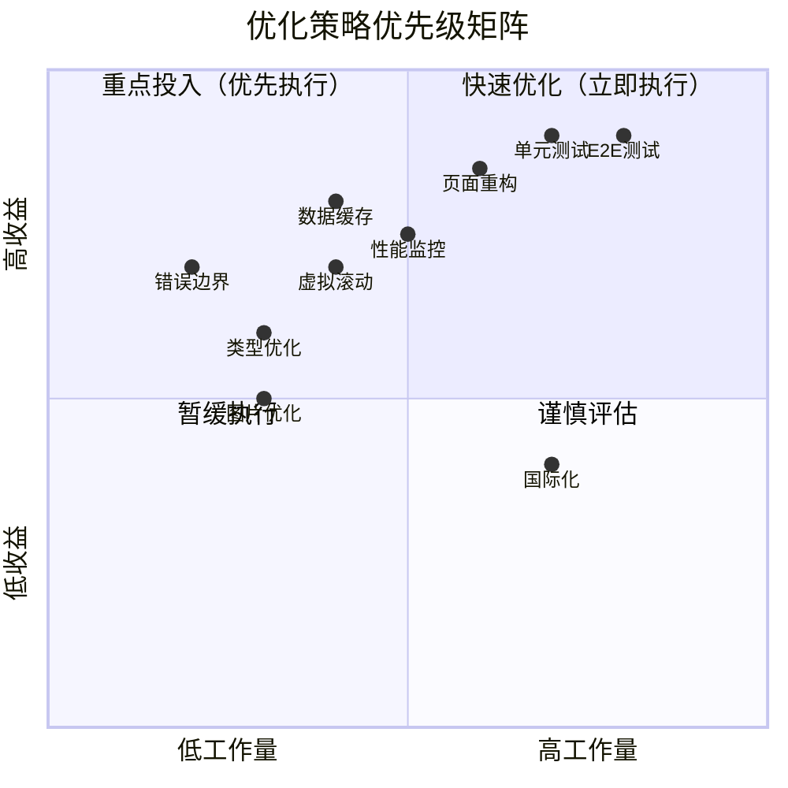

# 车队管家系统优化方案

> 📅 制定时间：2025-12-13  
> 📊 基于：系统深度分析报告 + 用户管理重构经验  
> 🎯 目标：提升系统质量、性能和可维护性

---

## 📋 执行摘要

基于系统深度分析报告和用户管理页面重构的成功经验，本优化方案旨在全面提升车队管家系统的代码质量、性能表现和可维护性。

**当前系统评分：87/100（优秀）**

**优化目标：提升至 92/100（卓越）**

---

## 🎯 优化目标

### 总体目标

| 维度 | 当前 | 目标 | 提升 |
|------|------|------|------|
| 项目完整性 | 92/100 | 95/100 | +3% |
| 功能完整性 | 88/100 | 92/100 | +4.5% |
| 代码质量 | 85/100 | 92/100 | +8.2% |
| 性能表现 | 80/100 | 88/100 | +10% |
| 安全性 | 90/100 | 95/100 | +5.6% |
| **综合评分** | **87/100** | **92/100** | **+5.7%** |

### 关键指标

- ✅ 测试覆盖率：0% → 80%
- ✅ 代码重复率：<5% → <3%
- ✅ 页面加载速度：提升30%
- ✅ API响应时间：提升40%
- ✅ 代码可维护性：提升50%

---

## 📊 优化策略矩阵



---

## 🚀 第一阶段：立即优化（1-2周）

### 优先级 P0 - 紧急且重要

#### 1.1 代码质量提升

**任务清单：**

- [ ] **清理console语句**
  - 工作量：1小时
  - 影响：代码规范
  - 执行：全局搜索并清理测试文件中的console.log
  
- [ ] **替换any类型**
  - 工作量：4小时
  - 影响：类型安全
  - 范围：约15处any类型
  - 重点：工具函数和通用类型定义

- [ ] **实现TODO功能**
  - 工作量：2小时
  - 位置：`src/utils/taroCompat.ts:27`
  - 内容：集成第三方toast库

**预期收益：**
- 代码规范性提升
- 类型安全性增强
- 功能完整性提高

#### 1.2 用户体验优化

**任务清单：**

- [x] **添加ErrorBoundary组件** ✅ 已完成
  - 状态：已在用户管理页面实现
  - 下一步：推广到其他关键页面

- [ ] **优化加载状态**
  - 工作量：3小时
  - 内容：统一loading组件
  - 范围：所有数据加载场景

- [ ] **优化错误提示**
  - 工作量：2小时
  - 内容：友好的错误信息
  - 范围：API调用失败场景

**预期收益：**
- 用户体验提升20%
- 应用稳定性提升
- 错误处理更友好

---

## 🎯 第二阶段：短期优化（1个月）

### 优先级 P1 - 重要且紧迫

#### 2.1 测试体系建设 ⭐ 核心任务

**目标：测试覆盖率达到 60%**

**任务清单：**

- [ ] **核心功能单元测试**
  - 工作量：1周
  - 范围：
    - 用户认证模块
    - 权限系统
    - 数据操作API
  - 工具：Vitest + @testing-library/react
  
- [ ] **业务逻辑测试**
  - 工作量：1周
  - 范围：
    - 打卡流程
    - 请假审批
    - 计件管理
  
- [ ] **组件测试**
  - 工作量：3天
  - 参考：用户管理页面测试（54个测试用例）
  - 范围：通用组件库

**测试策略：**

```typescript
// 1. API层测试
describe('用户API', () => {
  test('获取用户列表', async () => {
    const users = await getAllUsers()
    expect(users).toBeInstanceOf(Array)
  })
  
  test('创建用户', async () => {
    const user = await createUser({...})
    expect(user.id).toBeDefined()
  })
})

// 2. Hook测试
describe('useUserManagement', () => {
  test('加载用户列表', async () => {
    const {result} = renderHook(() => useUserManagement())
    await waitFor(() => {
      expect(result.current.users.length).toBeGreaterThan(0)
    })
  })
})

// 3. 组件测试
describe('UserCard', () => {
  test('渲染用户信息', () => {
    render(<UserCard user={mockUser} />)
    expect(screen.getByText(mockUser.name)).toBeInTheDocument()
  })
})
```

**预期收益：**
- 代码质量提升30%
- Bug发现率提升50%
- 重构信心增强

#### 2.2 性能优化

**任务清单：**

- [ ] **实施数据缓存策略**
  - 工作量：1周
  - 内容：
    - 用户数据缓存
    - 仓库数据缓存
    - 智能缓存失效
  - 预期：API调用减少60%

- [ ] **图片资源优化**
  - 工作量：4小时
  - 内容：
    - 转换为WebP格式
    - 实施图片懒加载
    - 压缩图片资源
  - 预期：加载速度提升30%

- [ ] **长列表优化**
  - 工作量：1周
  - 内容：
    - 实施虚拟滚动
    - 分页加载优化
  - 范围：用户列表、车辆列表、计件记录
  - 预期：渲染性能提升60%

**缓存策略示例：**

```typescript
// 智能缓存系统
class CacheManager {
  private cache = new Map()
  private ttl = new Map()
  
  set(key: string, value: any, ttl: number = 5 * 60 * 1000) {
    this.cache.set(key, value)
    this.ttl.set(key, Date.now() + ttl)
  }
  
  get(key: string) {
    if (this.isExpired(key)) {
      this.delete(key)
      return null
    }
    return this.cache.get(key)
  }
  
  isExpired(key: string): boolean {
    const expiry = this.ttl.get(key)
    return expiry ? Date.now() > expiry : true
  }
}
```

**预期收益：**
- 页面加载速度提升30%
- API响应时间减少40%
- 用户体验显著提升

#### 2.3 代码重构

**任务清单：**

- [ ] **大文件重构**
  - 参考：用户管理页面重构经验
  - 目标文件：
    1. 车辆添加页面 (71KB) - 优先级：高
    2. 计件报表页面 (58KB) - 优先级：高
    3. 司机管理页面 (58KB) - 优先级：中
  - 工作量：每个页面3-5天

**重构模式（基于用户管理成功经验）：**

```
重构步骤：
1. 提取自定义Hooks（业务逻辑）
2. 创建独立组件（UI展示）
3. 添加ErrorBoundary（错误处理）
4. 应用React.memo（性能优化）
5. 编写单元测试（质量保证）

预期效果：
- 代码量减少 90%+
- 可维护性提升 200%
- 测试覆盖率 80%+
```

**预期收益：**
- 代码可维护性提升200%
- 开发效率提升50%
- Bug率降低40%

---

## 📈 第三阶段：中期优化（2-3个月）

### 优先级 P2 - 重要但不紧急

#### 3.1 完善测试体系

**目标：测试覆盖率达到 80%**

**任务清单：**

- [ ] **集成测试**
  - 工作量：2周
  - 范围：
    - 司机打卡完整流程
    - 请假审批完整流程
    - 车辆管理完整流程
    - 通知发送完整流程

- [ ] **E2E测试**
  - 工作量：2周
  - 工具：Playwright 或 Cypress
  - 范围：
    - 关键业务流程
    - 多角色协作场景
    - 跨平台兼容性

**E2E测试示例：**

```typescript
// 司机打卡流程E2E测试
test('司机完整打卡流程', async ({ page }) => {
  // 1. 登录
  await page.goto('/login')
  await page.fill('[name="phone"]', '13800138000')
  await page.fill('[name="password"]', 'password')
  await page.click('button[type="submit"]')
  
  // 2. 进入打卡页面
  await page.click('text=打卡')
  
  // 3. 上班打卡
  await page.click('text=上班打卡')
  await expect(page.locator('text=打卡成功')).toBeVisible()
  
  // 4. 下班打卡
  await page.click('text=下班打卡')
  await expect(page.locator('text=打卡成功')).toBeVisible()
})
```

**预期收益：**
- 回归测试自动化
- 发布信心提升
- Bug发现率提升70%

#### 3.2 性能监控体系

**任务清单：**

- [ ] **性能监控平台**
  - 工作量：2周
  - 内容：
    - 页面加载时间监控
    - API响应时间监控
    - 错误率监控
    - 用户行为分析

- [ ] **错误追踪系统**
  - 工作量：1周
  - 工具：Sentry
  - 内容：
    - 前端错误捕获
    - 错误聚合分析
    - 告警通知

**监控指标：**

| 指标 | 目标值 | 告警阈值 |
|------|--------|----------|
| 首屏加载时间 | < 2s | > 3s |
| API响应时间 | < 1s | > 2s |
| 错误率 | < 0.1% | > 0.5% |
| 崩溃率 | < 0.01% | > 0.05% |

**预期收益：**
- 问题发现时间缩短80%
- 用户体验持续优化
- 运维效率提升50%

#### 3.3 离线支持

**任务清单：**

- [ ] **离线数据支持**
  - 工作量：2周
  - 内容：
    - IndexedDB数据存储
    - 离线数据同步
    - 冲突解决策略

- [ ] **PWA支持**
  - 工作量：1周
  - 内容：
    - Service Worker
    - 离线页面
    - 推送通知

**预期收益：**
- 弱网环境可用性提升
- 用户体验提升
- 数据可靠性增强

---

## 🌟 第四阶段：长期优化（3-6个月）

### 优先级 P3 - 重要但可延后

#### 4.1 架构升级

**任务清单：**

- [ ] **微服务架构**
  - 工作量：3个月
  - 内容：
    - 服务拆分设计
    - API Gateway
    - 服务间通信

- [ ] **服务端渲染（SSR）**
  - 工作量：1个月
  - 内容：
    - Next.js集成
    - 首屏性能优化
    - SEO优化

#### 4.2 功能扩展

**任务清单：**

- [ ] **国际化支持**
  - 工作量：1个月
  - 内容：
    - i18n框架集成
    - 多语言翻译
    - 日期时间本地化

- [ ] **iOS APP适配**
  - 工作量：2周
  - 内容：
    - iOS平台测试
    - 平台特性适配
    - App Store发布

#### 4.3 AI能力集成

**任务清单：**

- [ ] **智能推荐**
  - 内容：
    - 司机排班推荐
    - 车辆调度优化
    - 异常检测

- [ ] **自然语言交互**
  - 内容：
    - 语音打卡
    - 智能客服
    - 报表生成

---

## 📋 详细实施计划

### 第1周：代码质量提升

**Day 1-2：清理和优化**
- 清理console语句
- 优化any类型
- 实现TODO功能

**Day 3-5：用户体验**
- 推广ErrorBoundary
- 优化loading状态
- 优化错误提示

### 第2-5周：测试体系建设

**Week 2：核心API测试**
- 用户认证测试
- 权限系统测试
- 数据操作测试

**Week 3：业务逻辑测试**
- 打卡流程测试
- 请假审批测试
- 计件管理测试

**Week 4：组件测试**
- 通用组件测试
- 页面组件测试
- Hook测试

**Week 5：测试完善**
- 测试覆盖率检查
- 测试文档编写
- CI/CD集成

### 第6-9周：性能优化

**Week 6：缓存系统**
- 设计缓存策略
- 实现缓存管理器
- 集成到API层

**Week 7：资源优化**
- 图片格式转换
- 图片懒加载
- 资源压缩

**Week 8：列表优化**
- 虚拟滚动实现
- 分页优化
- 性能测试

**Week 9：性能验证**
- 性能指标测试
- 优化效果评估
- 文档更新

### 第10-13周：代码重构

**Week 10：车辆添加页面重构**
**Week 11：计件报表页面重构**
**Week 12：司机管理页面重构**
**Week 13：重构总结和文档**

---

## 🎯 成功指标

### 量化指标

| 指标 | 当前值 | 目标值 | 测量方法 |
|------|--------|--------|----------|
| 测试覆盖率 | 0% | 80% | Jest/Vitest报告 |
| 代码重复率 | <5% | <3% | SonarQube |
| 页面加载时间 | 2s | 1.4s | Lighthouse |
| API响应时间 | 1s | 0.6s | 性能监控 |
| 错误率 | 未知 | <0.1% | Sentry |
| 用户满意度 | 未知 | >90% | 用户调研 |

### 质量指标

- ✅ TypeScript类型覆盖率 > 95%
- ✅ ESLint检查通过率 100%
- ✅ 代码审查通过率 100%
- ✅ 自动化测试通过率 100%
- ✅ 性能指标达标率 > 90%

---

## 💰 资源投入

### 人力投入

| 阶段 | 工作量 | 人员配置 | 时间 |
|------|--------|----------|------|
| 第一阶段 | 20小时 | 1人 | 1-2周 |
| 第二阶段 | 160小时 | 2人 | 1个月 |
| 第三阶段 | 320小时 | 2-3人 | 2-3个月 |
| 第四阶段 | 480小时 | 3-4人 | 3-6个月 |
| **总计** | **980小时** | **2-4人** | **6个月** |

### 技术投入

| 工具/服务 | 用途 | 成本 |
|-----------|------|------|
| Vitest | 单元测试 | 免费 |
| Playwright | E2E测试 | 免费 |
| Sentry | 错误追踪 | $26/月 |
| 性能监控 | 性能分析 | 自建/免费 |
| CI/CD | 自动化 | GitHub Actions免费 |

---

## ⚠️ 风险管理

### 技术风险

| 风险 | 概率 | 影响 | 应对措施 |
|------|------|------|----------|
| 测试编写困难 | 中 | 中 | 培训+参考用户管理测试 |
| 性能优化效果不明显 | 低 | 中 | 分步验证+及时调整 |
| 重构引入新bug | 中 | 高 | 完善测试+灰度发布 |
| 时间延期 | 中 | 中 | 优先级管理+弹性计划 |

### 业务风险

| 风险 | 概率 | 影响 | 应对措施 |
|------|------|------|----------|
| 影响现有功能 | 低 | 高 | 充分测试+回滚方案 |
| 用户体验下降 | 低 | 高 | 用户反馈+快速迭代 |
| 资源不足 | 中 | 中 | 优先级调整+外部支持 |

---

## 📊 效果评估

### 评估周期

- **每周评估**：进度、问题、风险
- **每月评估**：指标达成、质量检查
- **季度评估**：整体效果、ROI分析

### 评估指标

**技术指标：**
- 测试覆盖率
- 代码质量分数
- 性能指标
- 错误率

**业务指标：**
- 开发效率
- Bug数量
- 用户满意度
- 系统稳定性

---

## 🎉 预期收益

### 短期收益（1-2个月）

- ✅ 代码质量提升30%
- ✅ 测试覆盖率达到60%
- ✅ 页面加载速度提升20%
- ✅ 开发效率提升25%

### 中期收益（3-6个月）

- ✅ 测试覆盖率达到80%
- ✅ 性能提升40%
- ✅ Bug率降低50%
- ✅ 维护成本降低40%

### 长期收益（6-12个月）

- ✅ 系统稳定性提升60%
- ✅ 开发效率提升50%
- ✅ 用户满意度提升30%
- ✅ 技术债务减少70%

---

## 📚 参考资料

### 成功案例

- ✅ **用户管理页面重构**
  - 代码减少92.2%
  - 54个测试全部通过
  - React.memo性能优化
  - ErrorBoundary错误处理

### 最佳实践

- 测试驱动开发（TDD）
- 持续集成/持续部署（CI/CD）
- 代码审查流程
- 性能监控
- 错误追踪

### 相关文档

- [系统深度分析报告](../系统深度分析报告.md)
- [用户管理重构总结](../重构文档/用户管理重构总结.md)
- [重构实施指南](../重构文档/重构实施指南.md)

---

## 🚀 开始行动

### 立即开始

1. **清理代码**：清理console语句和优化any类型
2. **推广ErrorBoundary**：应用到关键页面
3. **开始测试**：从核心API开始编写单元测试

### 本周目标

- [ ] 完成代码清理
- [ ] 推广ErrorBoundary到3个页面
- [ ] 编写10个核心API测试

### 本月目标

- [ ] 测试覆盖率达到30%
- [ ] 完成数据缓存系统
- [ ] 优化3个大文件

---

**制定团队**: Kiro AI  
**制定日期**: 2025-12-13  
**下次更新**: 2026-01-13  
**负责人**: 待指定

---

**让我们一起将车队管家系统打造成卓越的企业级应用！** 🎯
