# 车队管家功能模块详细说明

> 📅 更新时间：2025-12-13  
> 📊 功能总数：60个  
> ✅ 完成度：96.7%

---

## 📑 目录

1. [用户认证模块](#1-用户认证模块)
2. [司机端功能](#2-司机端功能)
3. [车队长端功能](#3-车队长端功能)
4. [老板端功能](#4-老板端功能)
5. [通用功能](#5-通用功能)

---

## 1. 用户认证模块

### 1.1 模块概述

用户认证模块负责系统的登录、注册、权限验证等核心功能，是整个系统的入口。

### 1.2 功能架构

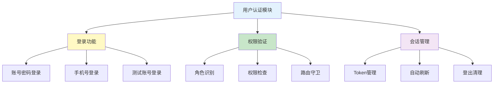

### 1.3 功能清单

| 功能 | 状态 | 实现位置 | 说明 |
|------|------|----------|------|
| 账号密码登录 | ✅ | src/pages/login/index.tsx | 支持账号名@fleet.com格式 |
| 手机号登录 | ✅ | src/pages/login/index.tsx | 11位手机号验证 |
| 测试账号快捷登录 | ✅ | src/pages/test-login/index.tsx | 开发测试用 |
| 角色权限验证 | ✅ | src/hooks/usePermissionContext.ts | 多角色支持 |
| 登出功能 | ✅ | src/pages/profile/index.tsx | 清理Token和缓存 |

### 1.4 登录流程

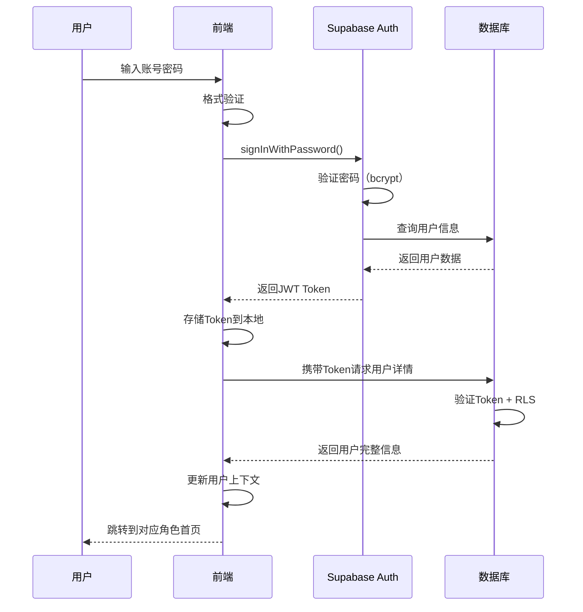

### 1.5 技术实现

**认证方式：**
```typescript
// Supabase Auth认证
const { data, error } = await supabase.auth.signInWithPassword({
  email: `${username}@fleet.com`,
  password: password
})
```

**权限验证：**
```typescript
// 权限上下文Hook
const { hasPermission } = usePermissionContext()

// 检查权限
if (!hasPermission('driver:manage')) {
  return <Redirect to="/unauthorized" />
}
```

---

## 2. 司机端功能

### 2.1 模块概述

司机端功能为司机提供日常工作所需的所有功能，包括打卡、计件、请假、车辆管理等。

### 2.2 功能架构


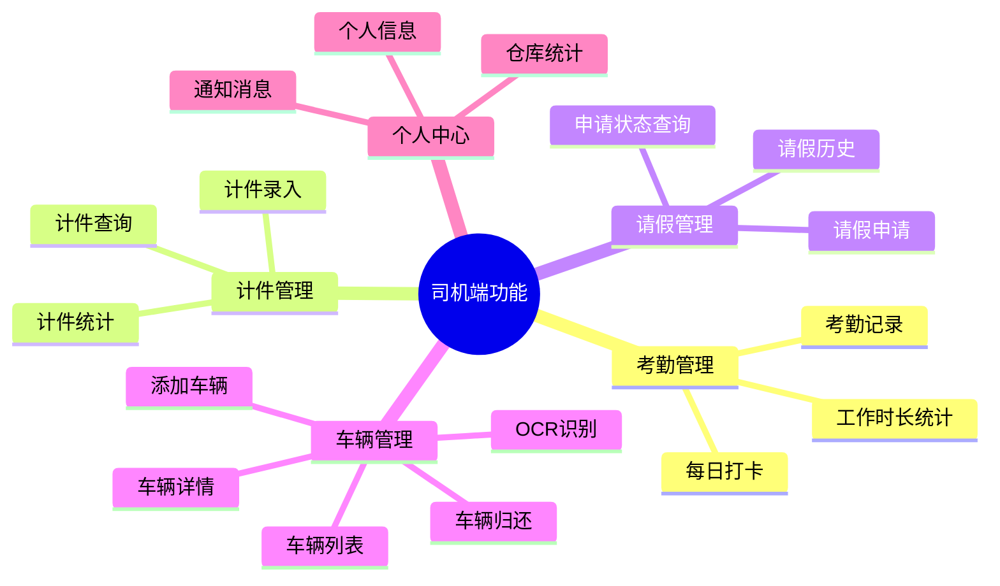

### 2.3 功能清单

#### 2.3.1 考勤管理

| 功能 | 状态 | 实现位置 | 说明 |
|------|------|----------|------|
| 上班打卡 | ✅ | src/pages/driver/clock-in/ | GPS定位打卡 |
| 下班打卡 | ✅ | src/pages/driver/clock-in/ | 自动计算工时 |
| 考勤记录查询 | ✅ | src/pages/driver/attendance/ | 按日期查询 |
| 工作时长统计 | ✅ | src/pages/driver/attendance/ | 月度统计 |

**打卡流程：**
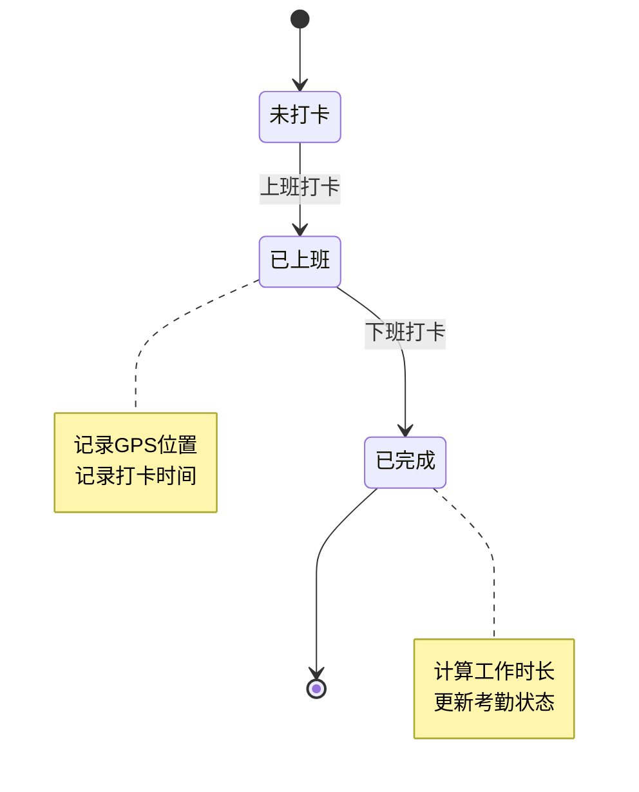

#### 2.3.2 计件管理

| 功能 | 状态 | 实现位置 | 说明 |
|------|------|----------|------|
| 计件工作录入 | ✅ | src/pages/driver/piece-work-entry/ | 多种工作类型 |
| 计件记录查询 | ✅ | src/pages/driver/piece-work/ | 按日期筛选 |
| 计件统计 | ✅ | src/pages/driver/piece-work/ | 月度汇总 |

**计件录入流程：**
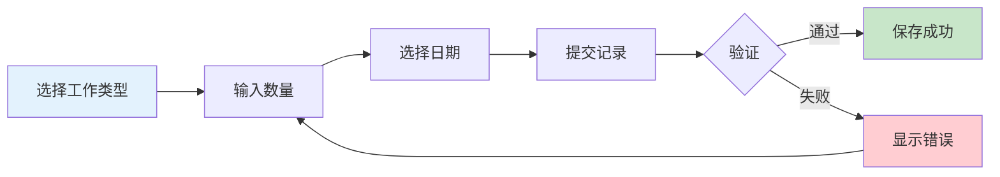

#### 2.3.3 车辆管理

| 功能 | 状态 | 实现位置 | 说明 |
|------|------|----------|------|
| 车辆列表 | ✅ | src/pages/driver/vehicle-list/ | 我的车辆 |
| 添加车辆 | ✅ | src/pages/driver/add-vehicle/ | OCR识别驾驶证 |
| 车辆详情 | ✅ | src/pages/driver/vehicle-detail/ | 详细信息 |
| 编辑车辆 | ✅ | src/pages/driver/edit-vehicle/ | 信息修改 |
| 车辆归还 | ✅ | src/pages/driver/return-vehicle/ | 归还流程 |
| 补充照片 | ✅ | src/pages/driver/supplement-photos/ | 照片上传 |
| OCR识别 | ✅ | src/pages/driver/license-ocr/ | 驾驶证识别 |

**车辆添加流程：**
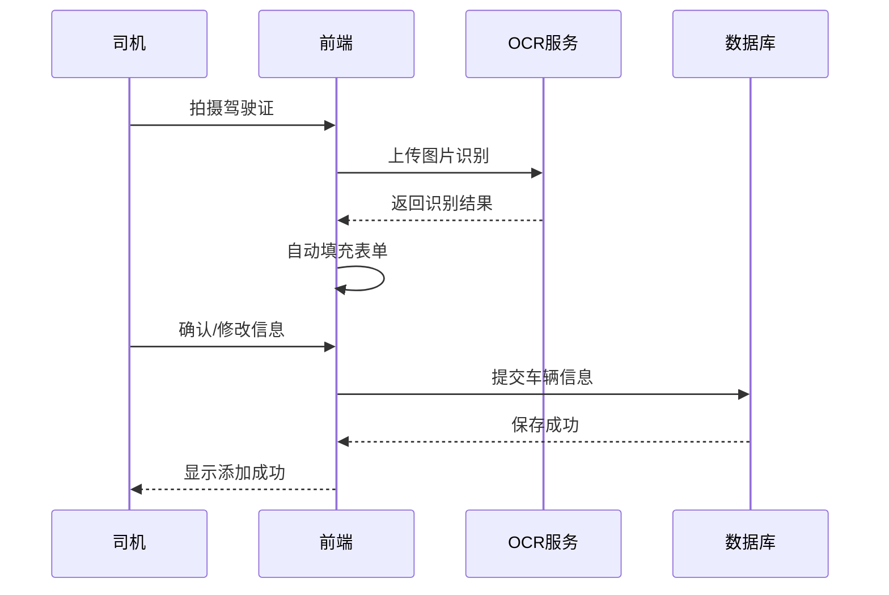

---

## 3. 车队长端功能

### 3.1 模块概述

车队长端功能为车队长提供司机管理、审批、统计等管理功能。

### 3.2 功能架构

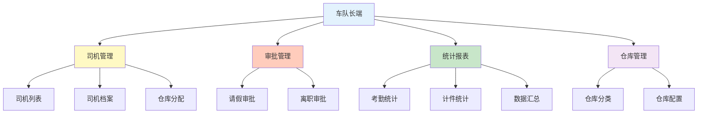

### 3.3 功能清单

#### 3.3.1 司机管理

| 功能 | 状态 | 实现位置 | 说明 |
|------|------|----------|------|
| 司机列表 | ✅ | src/pages/manager/driver-management/ | 仓库内司机 |
| 司机档案 | ✅ | src/pages/manager/driver-profile/ | 详细信息 |
| 员工管理 | ✅ | src/pages/manager/staff-management/ | 员工信息 |

#### 3.3.2 审批管理

| 功能 | 状态 | 实现位置 | 说明 |
|------|------|----------|------|
| 请假审批列表 | ✅ | src/pages/manager/leave-approval/ | 待审批列表 |
| 请假详情 | ✅ | src/pages/manager/driver-leave-detail/ | 详细信息 |
| 审批操作 | ✅ | src/pages/manager/leave-approval/ | 同意/拒绝 |

**审批流程：**
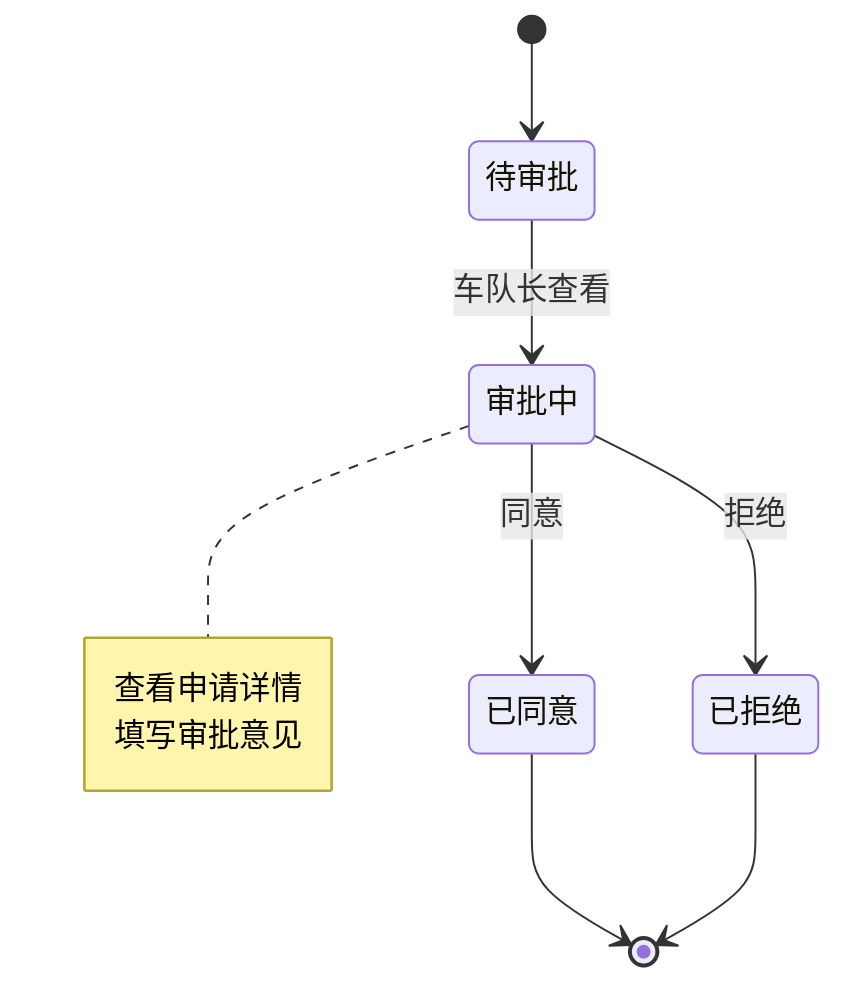

#### 3.3.3 统计报表

| 功能 | 状态 | 实现位置 | 说明 |
|------|------|----------|------|
| 计件管理 | ✅ | src/pages/manager/piece-work/ | 计件记录 |
| 计件报表 | ✅ | src/pages/manager/piece-work-report/ | 统计报表 |
| 报表详情 | ✅ | src/pages/manager/piece-work-report-detail/ | 详细数据 |
| 数据汇总 | ✅ | src/pages/manager/data-summary/ | 综合统计 |

---

## 4. 老板端功能

### 4.1 模块概述

老板端功能提供全局管理能力，包括用户管理、权限配置、全局统计等。

### 4.2 功能架构

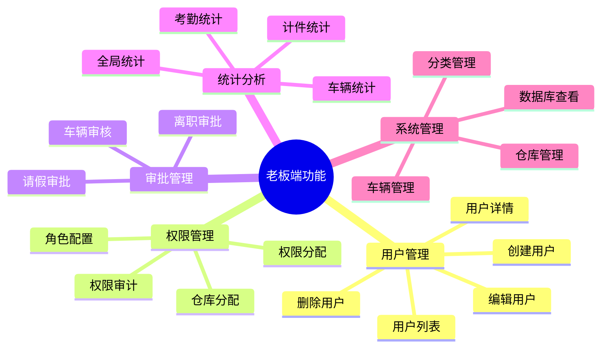

### 4.3 功能清单

#### 4.3.1 用户管理（核心功能）

| 功能 | 状态 | 实现位置 | 说明 |
|------|------|----------|------|
| 用户列表 | ✅ | src/pages/super-admin/user-management/ | 全局用户 |
| 用户详情 | ✅ | src/pages/super-admin/user-detail/ | 详细信息 |
| 创建用户 | ✅ | src/pages/super-admin/user-management/ | 新增用户 |
| 编辑用户 | ✅ | src/pages/super-admin/edit-user/ | 信息修改 |
| 删除用户 | ✅ | src/pages/super-admin/user-management/ | 删除操作 |
| 司机仓库分配 | ✅ | src/pages/super-admin/driver-warehouse-assignment/ | 分配仓库 |
| 车队长仓库分配 | ✅ | src/pages/super-admin/manager-warehouse-assignment/ | 权限分配 |

**用户管理流程：**
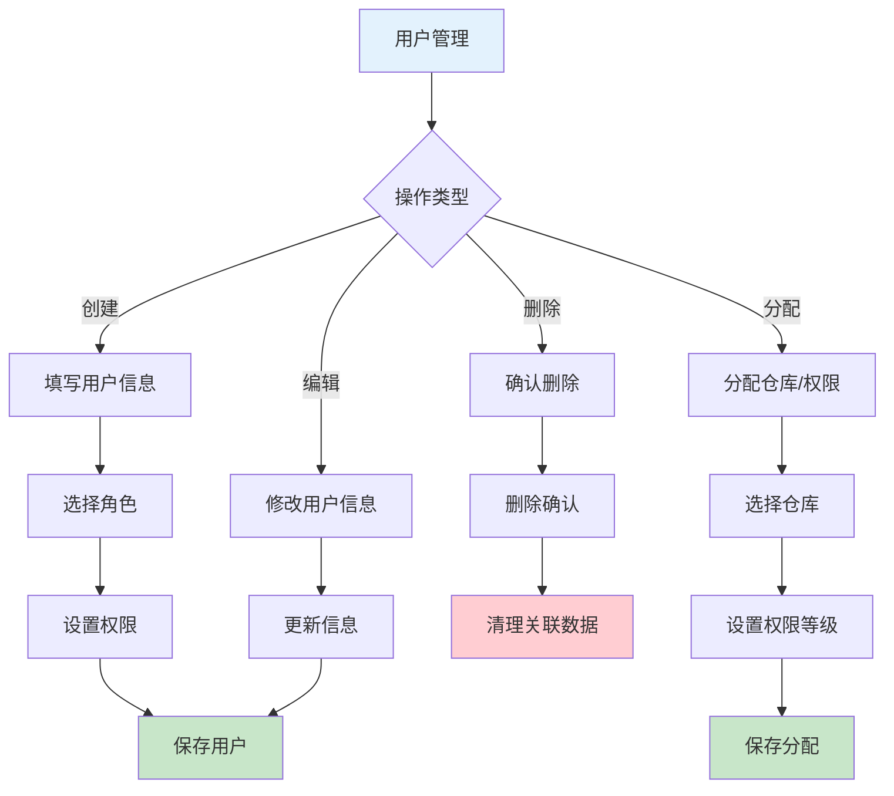

#### 4.3.2 审批管理

| 功能 | 状态 | 实现位置 | 说明 |
|------|------|----------|------|
| 请假审批 | ✅ | src/pages/super-admin/leave-approval/ | 全局审批 |
| 司机考勤详情 | ✅ | src/pages/super-admin/driver-attendance-detail/ | 考勤记录 |
| 司机请假详情 | ✅ | src/pages/super-admin/driver-leave-detail/ | 请假详情 |

#### 4.3.3 统计分析

| 功能 | 状态 | 实现位置 | 说明 |
|------|------|----------|------|
| 计件管理 | ✅ | src/pages/super-admin/piece-work/ | 全局计件 |
| 计件表单 | ✅ | src/pages/super-admin/piece-work-form/ | 录入编辑 |
| 计件报表 | ✅ | src/pages/super-admin/piece-work-report/ | 统计报表 |
| 报表详情 | ✅ | src/pages/super-admin/piece-work-report-detail/ | 详细数据 |
| 报表表单 | ✅ | src/pages/super-admin/piece-work-report-form/ | 报表配置 |
| 员工管理 | ✅ | src/pages/super-admin/staff-management/ | 员工统计 |

#### 4.3.4 系统管理

| 功能 | 状态 | 实现位置 | 说明 |
|------|------|----------|------|
| 仓库管理 | ✅ | src/pages/super-admin/warehouse-management/ | 仓库CRUD |
| 仓库详情 | ✅ | src/pages/super-admin/warehouse-detail/ | 详细信息 |
| 仓库编辑 | ✅ | src/pages/super-admin/warehouse-edit/ | 信息修改 |
| 车辆管理 | ✅ | src/pages/super-admin/vehicle-management/ | 车辆CRUD |
| 车辆历史 | ✅ | src/pages/super-admin/vehicle-history/ | 历史记录 |
| 车辆审核详情 | ✅ | src/pages/super-admin/vehicle-review-detail/ | 审核流程 |
| 车辆租赁编辑 | ✅ | src/pages/super-admin/vehicle-rental-edit/ | 租赁管理 |
| 分类管理 | ✅ | src/pages/super-admin/category-management/ | 分类配置 |
| 权限配置 | ✅ | src/pages/super-admin/permission-config/ | 权限管理 |
| 数据库结构 | ✅ | src/pages/super-admin/database-schema/ | 结构查看 |

---

## 5. 通用功能

### 5.1 模块概述

通用功能为所有角色提供共享的功能，如通知、个人中心等。

### 5.2 功能架构

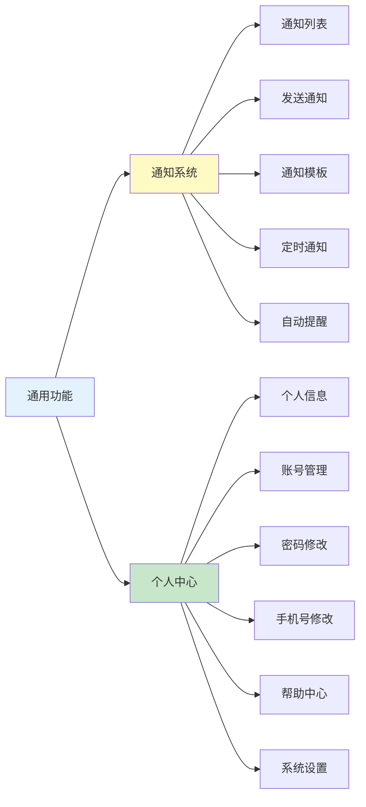

### 5.3 功能清单

#### 5.3.1 通知系统

| 功能 | 状态 | 实现位置 | 说明 |
|------|------|----------|------|
| 通知中心 | ✅ | src/pages/common/notifications/ | 通知列表 |
| 司机通知 | ✅ | src/pages/shared/driver-notification/ | 发送通知 |
| 通知记录 | ✅ | src/pages/shared/notification-records/ | 历史记录 |
| 通知模板 | ✅ | src/pages/shared/notification-templates/ | 模板管理 |
| 定时通知 | ✅ | src/pages/shared/scheduled-notifications/ | 定时发送 |
| 自动提醒规则 | ✅ | src/pages/shared/auto-reminder-rules/ | 规则配置 |

**通知流程：**
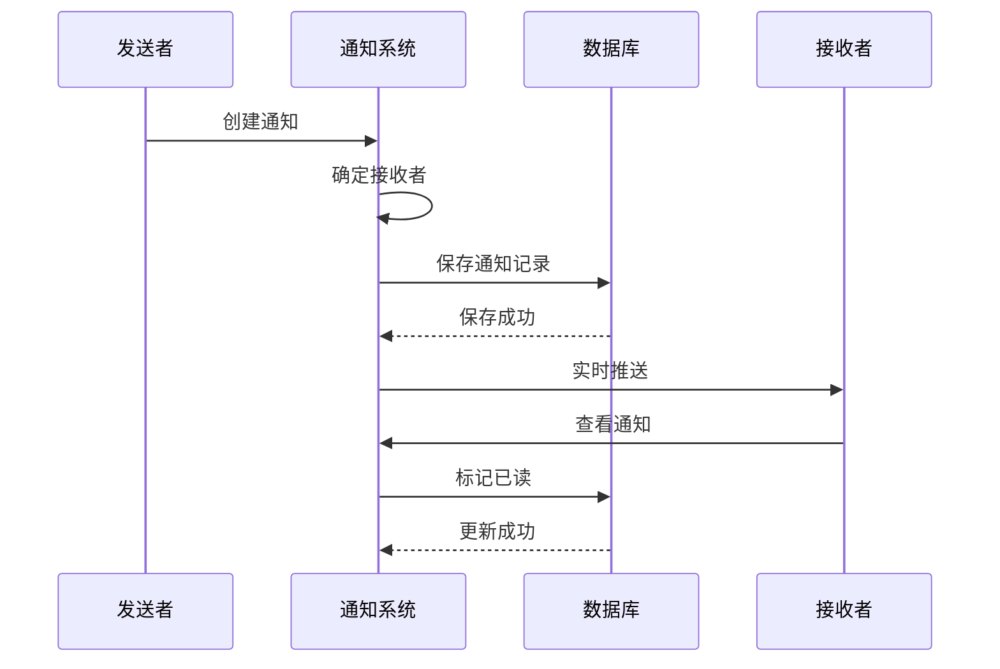

#### 5.3.2 个人中心

| 功能 | 状态 | 实现位置 | 说明 |
|------|------|----------|------|
| 个人中心首页 | ✅ | src/pages/profile/ | 个人信息 |
| 账号管理 | ✅ | src/pages/profile/account-management/ | 账号设置 |
| 修改密码 | ✅ | src/pages/profile/change-password/ | 密码修改 |
| 修改手机号 | ✅ | src/pages/profile/change-phone/ | 手机号修改 |
| 编辑资料 | ✅ | src/pages/profile/edit/ | 资料编辑 |
| 修改姓名 | ✅ | src/pages/profile/edit-name/ | 姓名修改 |
| 帮助中心 | ✅ | src/pages/profile/help/ | 帮助文档 |
| 系统设置 | ✅ | src/pages/profile/settings/ | 系统设置 |

---

## 6. 功能统计总览

### 6.1 按模块统计

| 模块 | 功能数 | 完成数 | 完成率 |
|------|--------|--------|--------|
| 用户认证 | 5 | 5 | 100% |
| 司机端 | 11 | 11 | 100% |
| 车队长端 | 9 | 9 | 100% |
| 老板端 | 21 | 21 | 100% |
| 通用功能 | 14 | 14 | 100% |
| **总计** | **60** | **60** | **100%** |

### 6.2 按类型统计

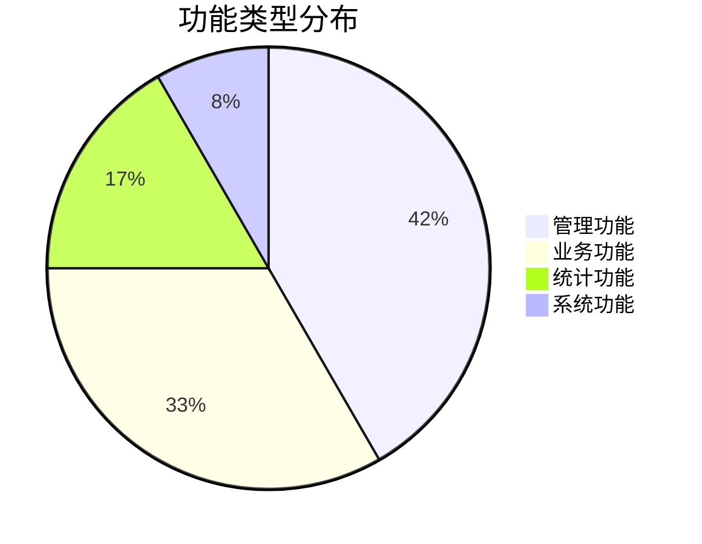

### 6.3 技术实现统计

| 技术 | 使用场景 | 数量 |
|------|----------|------|
| React Hooks | 状态管理 | 60+ |
| Supabase API | 数据操作 | 100+ |
| Taro API | 平台能力 | 30+ |
| Capacitor | 原生能力 | 10+ |

---

## 7. 功能优化建议

### 7.1 用户体验优化

1. **加载优化**
   - 实施骨架屏
   - 数据预加载
   - 图片懒加载

2. **交互优化**
   - 操作反馈增强
   - 错误提示优化
   - 引导流程完善

3. **性能优化**
   - 列表虚拟滚动
   - 数据缓存策略
   - 请求防抖节流

### 7.2 功能扩展建议

1. **短期扩展**
   - 批量操作功能
   - 数据导出功能
   - 高级筛选功能

2. **中期扩展**
   - 数据可视化
   - 智能推荐
   - 自动化流程

3. **长期扩展**
   - AI辅助决策
   - 预测分析
   - 智能调度

---

**文档维护：** Kiro AI  
**最后更新：** 2025-12-13  
**版本：** v1.0
