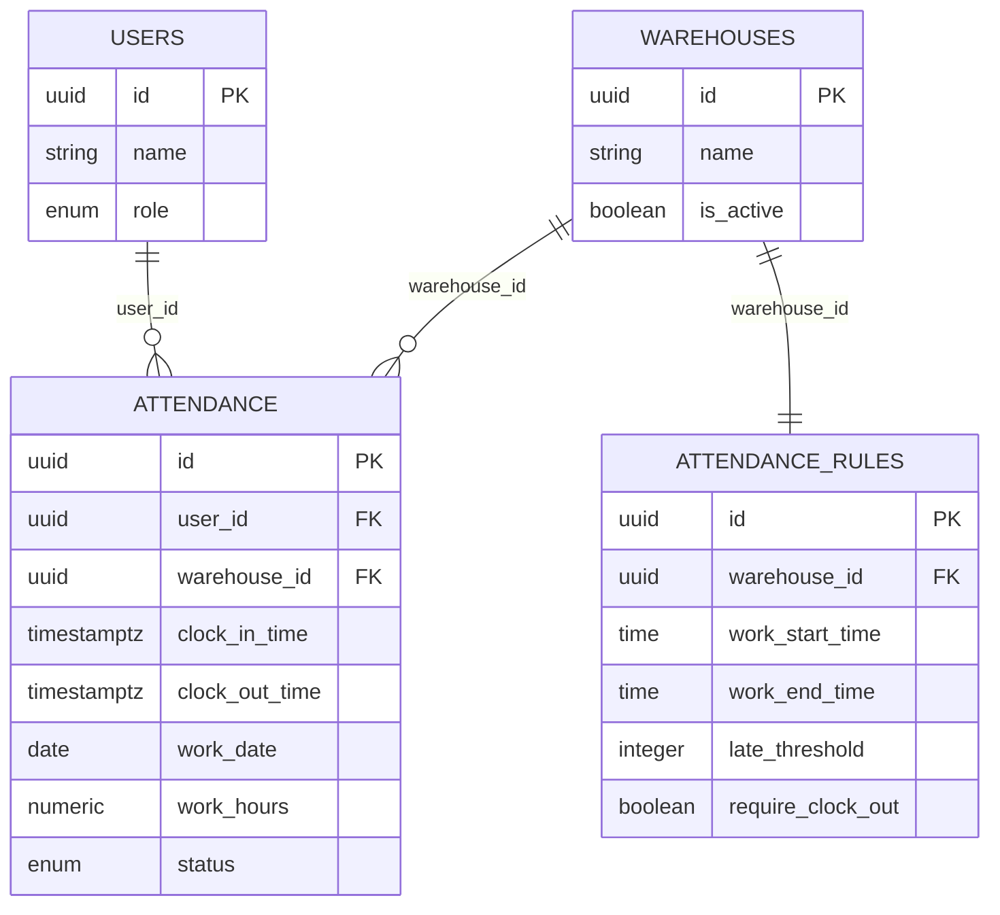
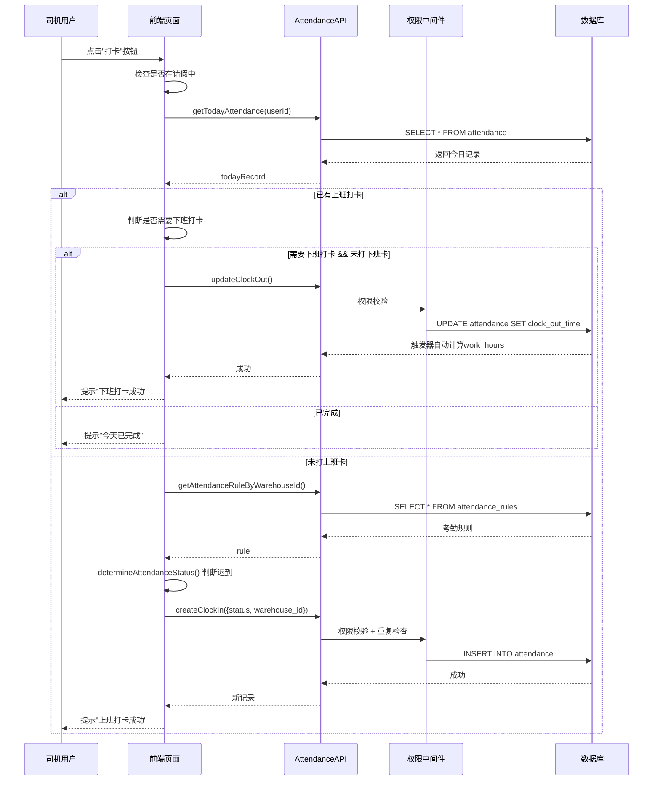

# 考勤管理系统架构梳理

## 📋 一、功能模块概览

### 1.1 核心功能
```
考勤管理系统
├── 打卡功能
│   ├── 上班打卡
│   ├── 下班打卡
│   └── 智能打卡(自动判断上/下班)
├── 考勤记录查询
│   ├── 司机端-个人记录
│   ├── 车队长端-管辖仓库记录
│   └── 老板端-全部记录
├── 考勤规则管理
│   ├── 上下班时间配置
│   ├── 迟到/早退阈值
│   └── 是否需要下班打卡
└── 考勤统计分析
    ├── 出勤天数统计
    ├── 迟到次数统计
    └── 工作时长统计
```

---

## 📊 二、数据表设计

### 2.1 attendance (考勤记录表)
```sql
CREATE TABLE attendance (
  id uuid PRIMARY KEY,
  user_id uuid NOT NULL REFERENCES profiles(id),
  warehouse_id uuid REFERENCES warehouses(id),
  clock_in_time timestamptz NOT NULL,      -- 上班打卡时间
  clock_out_time timestamptz,              -- 下班打卡时间
  work_date date NOT NULL,                 -- 工作日期
  work_hours numeric(5,2),                 -- 工作时长(自动计算)
  status attendance_status NOT NULL,       -- 状态: normal/late/early/absent
  notes text,
  created_at timestamptz NOT NULL,
  
  -- 约束
  UNIQUE(user_id, work_date),              -- 每人每天一条记录
  CHECK (work_hours >= 0),
  CHECK (clock_out_time > clock_in_time)
);

-- 索引
CREATE INDEX idx_attendance_user_id ON attendance(user_id);
CREATE INDEX idx_attendance_warehouse_id ON attendance(warehouse_id);
CREATE INDEX idx_attendance_work_date ON attendance(work_date);
CREATE INDEX idx_attendance_user_date ON attendance(user_id, work_date);
```

**字段说明**:
- `work_hours`: 通过触发器自动计算 (下班时间 - 上班时间)
- `status`: 根据考勤规则自动判断迟到/早退
- `UNIQUE(user_id, work_date)`: 防止重复打卡

---

### 2.2 attendance_rules (考勤规则表)
```sql
CREATE TABLE attendance_rules (
  id uuid PRIMARY KEY,
  warehouse_id uuid NOT NULL REFERENCES warehouses(id),
  work_start_time time NOT NULL,           -- 上班时间 (HH:MM)
  work_end_time time NOT NULL,             -- 下班时间 (HH:MM)
  late_threshold integer DEFAULT 15,       -- 迟到阈值(分钟)
  early_threshold integer DEFAULT 15,      -- 早退阈值(分钟)
  require_clock_out boolean DEFAULT true,  -- 是否需要下班打卡
  is_active boolean DEFAULT true,          -- 是否启用
  created_at timestamptz NOT NULL,
  updated_at timestamptz NOT NULL
);

-- 唯一约束: 每个仓库只能有一条启用的规则
CREATE UNIQUE INDEX idx_attendance_rules_warehouse_active
  ON attendance_rules(warehouse_id) WHERE is_active = true;
```

**业务规则**:
- 每个仓库只能有**一条启用的规则**
- 如果 `require_clock_out = false`, 上班打卡后直接完成
- 迟到判断: `打卡时间 - 上班时间 > late_threshold`

---

### 2.3 表关联关系


---

## 🏗️ 三、系统架构

### 3.1 整体架构图
```
┌─────────────────────────────────────────────────────┐
│                    前端层                            │
│  ┌─────────────┐  ┌─────────────┐  ┌─────────────┐ │
│  │ 司机端打卡   │  │车队长端查询 │  │ 老板端管理   │ │
│  │ clock-in/   │  │ driver-     │  │ driver-     │ │
│  │ index.tsx   │  │ leave-      │  │ attendance- │ │
│  │             │  │ detail/     │  │ detail/     │ │
│  └─────────────┘  └─────────────┘  └─────────────┘ │
└─────────────────────────────────────────────────────┘
            ↓                  ↓                  ↓
┌─────────────────────────────────────────────────────┐
│                    API层                             │
│               /src/db/api/attendance.ts              │
│  ┌──────────────────────────────────────────────┐   │
│  │ • getAllAttendanceRecords()                  │   │
│  │ • getTodayAttendance()                       │   │
│  │ • createClockIn()                            │   │
│  │ • updateClockOut()                           │   │
│  │ • getAttendanceRuleByWarehouseId()           │   │
│  │ • createAttendanceRule()                     │   │
│  │ • updateAttendanceRule()                     │   │
│  └──────────────────────────────────────────────┘   │
└─────────────────────────────────────────────────────┘
            ↓                  ↓                  ↓
┌─────────────────────────────────────────────────────┐
│                权限中间件层                           │
│         /src/db/middleware/permissionMiddleware.ts   │
│  ┌──────────────────────────────────────────────┐   │
│  │ createPermissionQuery() → 权限过滤            │   │
│  │ validateSensitiveDataAccess() → 敏感数据校验 │   │
│  │ applyRoleFilter() → WHERE条件注入             │   │
│  └──────────────────────────────────────────────┘   │
└─────────────────────────────────────────────────────┘
            ↓                  ↓                  ↓
┌─────────────────────────────────────────────────────┐
│                  数据库层                            │
│               Supabase PostgreSQL                    │
│  ┌──────────────────────────────────────────────┐   │
│  │ • attendance 表                              │   │
│  │ • attendance_rules 表                        │   │
│  │ • 触发器: auto_calculate_work_hours()        │   │
│  │ • 函数: determine_attendance_status()        │   │
│  └──────────────────────────────────────────────┘   │
└─────────────────────────────────────────────────────┘
```

---

### 3.2 权限控制架构 (纯应用层)

**权限矩阵**:
| 操作 | BOSS | PEER_ADMIN | MANAGER | DRIVER |
|------|------|------------|---------|--------|
| 查看所有考勤 | ✅ | ✅ (full_control) | ❌ | ❌ |
| 查看管辖仓库考勤 | ✅ | ✅ | ✅ | ❌ |
| 查看个人考勤 | ✅ | ✅ | ✅ | ✅ |
| 创建打卡 | ✅ | ✅ | ✅ | ✅ (仅本人) |
| 修改考勤记录 | ✅ | ✅ (full_control) | ✅ (full_control) | ❌ |
| 删除考勤记录 | ✅ | ✅ (full_control) | ❌ | ❌ |
| 管理考勤规则 | ✅ | ✅ (full_control) | ❌ | ❌ |

**权限过滤逻辑**:
```typescript
// DRIVER: 只能看自己
query.eq('user_id', userId)

// MANAGER: 看管辖仓库
query.in('warehouse_id', warehouseIds)

// PEER_ADMIN: 
//  - full_control: 看全部
//  - view_only: 看全部但不能改

// BOSS: 无限制
```

---

## 🔄 四、核心业务流程

### 4.1 打卡流程


---

### 4.2 考勤状态判断逻辑
```typescript
function determineAttendanceStatus(
  clockTime: Date,
  workStartTime: string,     // "08:00"
  workEndTime: string,        // "17:00"
  lateThreshold: number,      // 15分钟
  earlyThreshold: number,     // 15分钟
  isClockOut: boolean
): AttendanceStatus {
  if (isClockOut) {
    // 下班打卡: 判断是否早退
    const diff = endMinutes - clockMinutes
    return diff > earlyThreshold ? 'early' : 'normal'
  } else {
    // 上班打卡: 判断是否迟到
    const diff = clockMinutes - startMinutes
    return diff > lateThreshold ? 'late' : 'normal'
  }
}
```

---

### 4.3 工作时长自动计算
```sql
-- 数据库触发器
CREATE TRIGGER trigger_auto_calculate_work_hours
  BEFORE INSERT OR UPDATE ON attendance
  FOR EACH ROW
  EXECUTE FUNCTION auto_calculate_work_hours();

-- 触发函数
CREATE FUNCTION auto_calculate_work_hours()
RETURNS TRIGGER AS $$
BEGIN
  IF NEW.clock_out_time IS NOT NULL THEN
    NEW.work_hours := ROUND(
      EXTRACT(EPOCH FROM (NEW.clock_out_time - NEW.clock_in_time)) / 3600, 
      2
    );
  END IF;
  RETURN NEW;
END;
$$ LANGUAGE plpgsql;
```

---

## 📁 五、代码文件结构

```
考勤管理相关文件
├── 前端页面
│   ├── src/pages/driver/
│   │   ├── clock-in/index.tsx          # 司机打卡页面 ⭐核心
│   │   └── attendance/index.tsx        # 司机考勤记录查询
│   ├── src/pages/manager/
│   │   └── driver-leave-detail/        # 车队长查看司机详情(含考勤)
│   └── src/pages/super-admin/
│       ├── driver-attendance-detail/   # 老板查看考勤详情
│       └── leave-approval/index.tsx    # 老板端审批(含考勤统计)
│
├── API层
│   └── src/db/api/attendance.ts        # 考勤API ⭐核心
│
├── 工具函数
│   └── src/utils/attendance-check.ts   # 打卡校验工具
│
├── 权限中间件
│   ├── src/db/middleware/permissionMiddleware.ts
│   └── src/utils/permissionFilter.ts
│
└── 数据库迁移
    ├── supabase/migrations/004_create_attendance_tables.sql  # 表结构 ⭐
    ├── supabase/migrations/00537_apply_new_rls_policies_for_attendance_table.sql
    └── supabase/migrations/99999_disable_all_rls.sql  # 移除RLS
```

---

## ⚠️ 六、当前存在的问题

### 6.1 数据一致性问题
1. **RLS已移除,但部分SQL文件仍有RLS策略残留**
   - 位置: `migrations/00537_*`, `CREATE_ATTENDANCE_RULES.sql`
   - 影响: 可能导致权限混乱
   - 建议: 清理所有RLS相关SQL

2. **字段命名不统一**
   ```
   attendance_rules表:
   - 旧字段: start_time, end_time
   - 新字段: work_start_time, work_end_time
   
   代码中同时使用两种命名:
   rule.work_start_time || rule.start_time  // 兼容处理
   ```
   - 影响: 代码可读性差,容易出错
   - 建议: 统一字段命名为 `work_start_time`

3. **多条规则导致查询异常**
   - 问题: 同一仓库可能存在多条规则(is_active都为true)
   - 错误: PGRST116 (返回多行,期望单行)
   - 建议: 添加唯一约束 + 数据清理

---

### 6.2 性能优化点
1. **缺少复合索引**
   ```sql
   -- 建议添加
   CREATE INDEX idx_attendance_warehouse_date 
     ON attendance(warehouse_id, work_date);
   ```

2. **前端频繁查询**
   - 问题: 每次打开页面都查询今日记录
   - 建议: 使用本地缓存 + 定时刷新

3. **考勤规则查询未缓存**
   - 问题: 每次打卡都查询规则
   - 建议: 前端缓存规则 (按warehouse_id)

---

### 6.3 业务逻辑问题
1. **打卡防作弊机制缺失**
   - 当前无GPS定位校验
   - 无打卡距离限制
   - 建议: 添加位置校验逻辑

2. **请假期间允许打卡**
   - 问题: 前端检查但无强制约束
   - 建议: 数据库层添加CHECK约束

3. **考勤状态判断不够精确**
   - 缺勤(absent)状态未实现
   - 建议: 添加定时任务标记缺勤

---

### 6.4 代码质量问题
1. **日志输出过多**
   ```typescript
   console.log('[考勤记录页面] 开始加载考勤记录', ...)
   ```
   - 影响: 生产环境污染控制台
   - 建议: 移除或改为开发环境专用

2. **硬编码的默认值**
   ```typescript
   const DEFAULT_RULE = {
     clock_in_start: '08:00', 
     clock_in_end: '09:00',
     ...
   }
   ```
   - 建议: 从配置表读取

3. **错误处理不统一**
   - 有些返回空数组,有些抛异常
   - 建议: 统一错误处理策略

---

## 💡 七、优化建议

### 7.1 短期优化 (1-2天)
1. **清理RLS残留**
   - 删除所有RLS策略SQL
   - 验证纯应用层权限正常

2. **统一字段命名**
   ```sql
   ALTER TABLE attendance_rules 
     RENAME COLUMN start_time TO work_start_time,
     RENAME COLUMN end_time TO work_end_time;
   ```

3. **添加数据唯一性约束**
   ```sql
   -- 清理重复规则
   DELETE FROM attendance_rules 
   WHERE id NOT IN (
     SELECT MIN(id) 
     FROM attendance_rules 
     GROUP BY warehouse_id, is_active
   );
   ```

---

### 7.2 中期优化 (1周)
1. **性能优化**
   - 添加复合索引
   - 前端缓存优化
   - 减少不必要的查询

2. **增强业务逻辑**
   - GPS定位校验
   - 请假期间禁止打卡
   - 自动标记缺勤

3. **代码重构**
   - 统一错误处理
   - 移除调试日志
   - 提取常量到配置

---

### 7.3 长期优化 (1个月)
1. **考勤报表系统**
   - 月度考勤汇总
   - 迟到统计分析
   - 工资计算联动

2. **排班管理**
   - 支持多班次
   - 轮班自动排班
   - 调班申请流程

3. **移动端优化**
   - 离线打卡支持
   - 打卡提醒推送
   - 考勤异常预警

---

## 🎯 八、关键优化点总结

**核心问题**:
1. ❌ RLS残留导致权限混乱
2. ❌ 字段命名不统一
3. ❌ 多条规则导致查询失败

**优先级排序**:
1. 🔥 **P0 - 立即修复**: 清理RLS残留 + 数据唯一性约束
2. ⚡ **P1 - 本周完成**: 统一字段命名 + 性能优化
3. 📈 **P2 - 下月规划**: 业务增强 + 报表系统

---

**结束** 🎉
